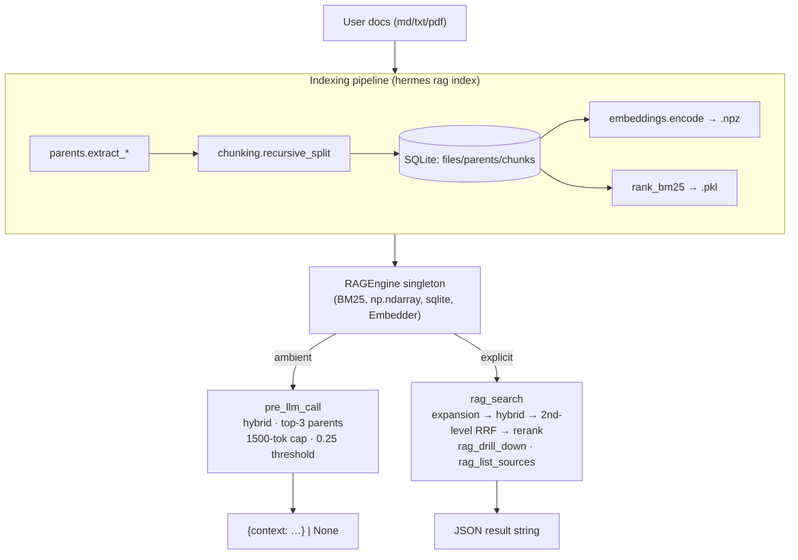

# BUILD.md — Hermes `advanced-rag` Plugin

This document is the single source of truth for building the `advanced-rag` Hermes Agent plugin. It supersedes and replaces the earlier `Hermes advanced-rag Plugin — Implementation Plan.md` and `Hermes advanced-rag Plugin — Refined Implementation Plan.md` — those two files can be deleted once this document is in place.

Read it top to bottom, follow the phases in order, and use the `pytest -q` gates as the signal to advance. Do not skip Phase 0.

## 1. Context

The plugin combines two RAG techniques over local user documents (md/txt/pdf):

- **Advanced RAG**: smart recursive chunking, hybrid BM25 + dense search fused via Reciprocal Rank Fusion (RRF), LLM-based query expansion (paraphrases + HyDE), and a reranking stage (Cohere API or local cross-encoder).
- **Hierarchical RAG**: embed small (~300-char) chunks for precise matching, but return their **parent units** (markdown sections, PDF pages, or paragraph groups) for rich context.

The plugin exposes:

- An ambient `pre_llm_call` hook that injects the top-3 most relevant parents (cap 1500 tokens) every turn, gated by a relevance threshold.
- Three tools: `rag_search` (full pipeline with expansion + rerank), `rag_drill_down` (chunks of a parent), `rag_list_sources` (catalog).
- CLI: `hermes rag {index,stats,clear}`.
- Slash commands: `/rag`, `/rag on|off`, `/rag stats`.
- A bundled skill (`rag-usage`) teaching the agent when to use each retrieval mode.

The retrieval target is **always a parent**, never a chunk. Chunks are the search space; parents are the unit returned.

## 2. Constraints

1. **Dev machine ≠ runtime machine.** Canonical project root is `/home/sergi/Documentos/advanced-rag/`. Hermes runs elsewhere; `~/.hermes/plugins/advanced-rag/` does not exist on the dev machine and must not be created here.
2. **Runtime state never appears in the repo.** `data/` (SQLite, `.npz`, BM25 pickle) is created lazily on first index/use on the runtime machine. Gitignored. Never written to during dev.
3. **Data dir is overridable** via `HERMES_RAG_DATA_DIR`. Tests always pass `tmp_path` through this env var or the `data_dir=` constructor argument — never touch the default location.
4. **Pure functions are unit-tested directly.** Hermes adapter layer is small enough to inspect by eye and is verified manually post-deploy.
5. **Light dep install on dev only.** Install `numpy`, `rank_bm25`, `pyyaml`, `pytest`. Stub `sentence-transformers`, `anthropic`, `cohere`, `pypdf` in tests. No torch download on the dev machine.

## 3. Architecture



`rag_search` pipeline detail:

```
query ─► expand_query ─► [q, p1, p2, p3, hyde]
                              │
                              ▼ per variant
                         hybrid_search (BM25+dense, RRF, top-30 chunks)
                              │
                              ▼ fuse all variants
                         second-level RRF on chunk rankings → top-30
                              │
                              ▼ chunks_to_parents (MAX rollup) → ~10 parents
                              │
                              ▼ rerank (Cohere or local cross-encoder)
                              │
                              ▼ top-k
                         JSON response
```

The second-level RRF fuses **chunk** rankings (not parent rankings) so the fusion benefits from all matched evidence; the parent rollup happens once afterward.

## 4. Project layout

```
/home/sergi/Documentos/advanced-rag/
├── .git/
├── .gitignore                       # data/, __pycache__/, .pytest_cache/, *.pyc, .venv/, .mypy_cache/, *.egg-info
├── BUILD.md                         # this file
├── HERMES_API.md                    # Phase 0 output (created during build)
├── README.md                        # install, usage, architecture, deployment (Phase 8)
├── pyproject.toml                   # entry-point install option
├── requirements.txt                 # runtime + dev deps, optional deps marked
├── advanced_rag/                # deployable plugin payload (what gets rsync'd)
│   ├── plugin.yaml                  # Hermes manifest
│   ├── requirements.txt             # COPY of repo-root file (so a single rsync carries deps)
│   ├── __init__.py                  # register(ctx) — Hermes adapter only
│   ├── adapters.py                  # closures wrapping pure handlers for ctx.*
│   ├── config.py                    # paths (with HERMES_RAG_DATA_DIR override), tunables
│   ├── chunking.py                  # recursive_split
│   ├── parents.py                   # extract_md/txt/pdf, _enforce_parent_cap
│   ├── storage.py                   # Store class — sqlite + npz + pickle
│   ├── embeddings.py                # Embedder (lazy MiniLM)
│   ├── indexing.py                  # index_path, _index_file, manifest diff
│   ├── retrieval.py                 # hybrid_search, rrf_fuse, chunks_to_parents
│   ├── expansion.py                 # expand_query (Anthropic SDK + fallback)
│   ├── rerank.py                    # rerank (Cohere API or local cross-encoder)
│   ├── engine.py                    # RAGEngine singleton, get_engine()
│   ├── state.py                     # file-backed ambient toggle
│   ├── hooks.py                     # ambient_pre_llm_call(...)
│   ├── tools.py                     # tool_rag_search/drill_down/list_sources (pure)
│   ├── schemas.py                   # JSON Schema dicts for the three tools
│   ├── cli.py                       # setup_rag_parser(parser), handle_rag(args)
│   ├── slash.py                     # slash_rag(rest) dispatcher
│   └── skills/
│       └── rag-usage/
│           └── SKILL.md
└── tests/
    ├── conftest.py                  # adds project root to sys.path; tmp_data_dir fixture
    ├── fixtures/
    │   └── docs/
    │       ├── alpha.md             # 3 sections w/ ## headings
    │       ├── beta.md              # no ## headings (forces fallback)
    │       └── gamma.txt            # ~30 paragraphs
    ├── test_chunking.py
    ├── test_parents.py
    ├── test_storage.py
    ├── test_indexing.py             # uses stub Embedder
    ├── test_retrieval.py
    ├── test_rrf.py
    ├── test_expansion.py            # mocked anthropic
    ├── test_rerank.py               # mocked cohere + cross-encoder
    ├── test_state.py
    ├── test_hook.py                 # uses stub engine
    ├── test_tools.py                # asserts JSON shape, never raises
    ├── test_cli.py                  # parses argv, runs handler with monkey-patched store
    ├── test_slash.py
    └── test_adapters.py             # fake ctx records register_* calls
```

## 5. Data dir precedence (single rule)

`get_data_dir()` resolves in this order:

1. Explicit `Store(data_dir=...)` constructor argument (highest priority).
2. `HERMES_RAG_DATA_DIR` environment variable.
3. Default: `~/.hermes/plugins/advanced-rag/data/`.

Tests use the env var (set via the `tmp_data_dir` fixture) or pass `data_dir=tmp_path` explicitly. Production paths use the default. This rule is the only thing keeping tests from polluting the user's real index — keep it strict.

## 6. Test strategy

`tests/conftest.py`:

- Adds project root to `sys.path` so `import advanced_rag.tools` works.
- `tmp_data_dir` fixture: sets `HERMES_RAG_DATA_DIR=tmp_path` and yields the path.
- `stub_embedder` fixture: deterministic vectors (e.g., `np.array([hash(t) % N / N] * 384)`, then L2-normalized).
- `fake_ctx` fixture: records `register_tool/hook/cli_command/command/skill` calls into a dict.
- `mock_anthropic`, `mock_cohere`, `mock_cross_encoder`: monkey-patches.

What runs without heavy deps on the dev machine:

- `test_chunking`, `test_parents` (md/txt directly; pdf via `monkeypatch.setattr(parents, "PdfReader", FakePdfReader)`).
- `test_storage`, `test_state`.
- `test_indexing` with stub Embedder.
- `test_retrieval`, `test_rrf` with stub Embedder + tiny synthetic corpus.
- `test_expansion`, `test_rerank` with mocks.
- `test_hook`, `test_tools` with stub engine.
- `test_cli`, `test_slash`, `test_adapters` — pure logic + fake ctx.

What does **not** run on the dev machine:

- Real MiniLM embedding (no `sentence-transformers` installed).
- Real cross-encoder rerank.
- Real Cohere/Anthropic API calls.
- Real Hermes integration — verified manually after deploy.

---

# Build Phases

Each phase ends with `pytest -q` green before moving on. Test counts are targets, not exact requirements.

## Phase 0 — Hermes API Verification (BLOCKING)

**User-driven.** Before any adapter code is written (Phase 7), confirm the actual Hermes signatures against the Hermes source. Output of this phase: a 1-page `HERMES_API.md` committed to repo root listing the actual signatures. Phases 1–6 do **not** depend on it.

Confirm these:

1. `ctx.register_tool(name, toolset, schema, handler)` — exact handler signature (positional vs. kwargs, return type).
2. `ctx.register_hook("pre_llm_call", fn)` — exact `fn` signature and return contract (`dict | None`? `{"context": str}`? other key?).
3. `ctx.register_cli_command(name, help, setup_fn, handler_fn)` — argparse-based vs. click vs. custom; what `setup_fn` receives; what `handler_fn` returns (exit code int?).
4. `ctx.register_command(name, handler, description)` — slash handler signature; whether `session_id` or other context is available via `**kwargs`.
5. `ctx.register_skill(name, path)` — and the `SKILL.md` frontmatter keys (`name`/`description`? other?).
6. Whether `on_session_start` (or equivalent) hook exists for engine warming.

The output of Phase 0 directly determines:

- The closure shapes inside `adapters.py` (Phase 7).
- The body of `__init__.py::register(ctx)` (Phase 7).
- The frontmatter of `skills/rag-usage/SKILL.md` (Phase 7).
- Whether v0.1 includes an `on_session_start` warm hook (yes if confirmed, otherwise deferred to v0.2).

## Phase 1 — Repo skeleton (no tests yet)

Create files:

- `.gitignore` — `data/`, `__pycache__/`, `.pytest_cache/`, `*.pyc`, `.venv/`, `.mypy_cache/`, `*.egg-info`.
- `requirements.txt` (root) — see §Dependency Strategy below.
- `pyproject.toml` with the entry-point block:
  ```toml
  [project.entry-points."hermes_agent.plugins"]
  advanced-rag = "advanced_rag"
  ```
- `advanced_rag/__init__.py` — empty placeholder (real `register(ctx)` lands in Phase 7).
- `tests/conftest.py` with `sys.path` injection + `tmp_data_dir` fixture + empty stub fixtures.

Install dev deps:

```bash
pip install numpy rank_bm25 pytest pyyaml
```

**Gate:** `pytest -q` runs (collects 0 tests, exits 0).

## Phase 2 — Pure data layer (~12 tests)

Files: `config.py`, `chunking.py`, `parents.py`, `storage.py`. Fixtures: `tests/fixtures/docs/{alpha.md, beta.md, gamma.txt}`.

### `config.py`

```python
from pathlib import Path
import os

DEFAULT_DATA_DIR = Path.home() / ".hermes" / "plugins" / "advanced-rag" / "data"

def get_data_dir() -> Path:
    env = os.environ.get("HERMES_RAG_DATA_DIR")
    return Path(env) if env else DEFAULT_DATA_DIR

# Path helpers (Store.__init__ creates the dir lazily):
def db_path(): ...
def npz_path(): ...
def bm25_path(): ...
def toggles_path(): ...
```

Constants:

```python
MAX_CHUNK = 300
CHUNK_OVERLAP = 50
MAX_PARENT_CHARS = 8000
RRF_K = 60
AMBIENT_TOP_PARENTS = 3
AMBIENT_TOKEN_CAP = 1500              # target ~1200 to leave room for other plugins
AMBIENT_SCORE_THRESHOLD = 0.25         # placeholder, tune in v0.2
EMBED_MODEL = "all-MiniLM-L6-v2"
RERANK_MODEL = "cross-encoder/ms-marco-MiniLM-L-6-v2"
ANTHROPIC_MODEL = "claude-haiku-4-5-20251001"
```

### `chunking.py`

```python
def recursive_split(
    text: str,
    max_size: int = 300,
    overlap: int = 50,
    separators: tuple = ("\n\n", "\n", ". ", " ", ""),
) -> list[str]:
    """
    Greedy pack of split parts; recurses on remaining separator list when a
    single part overflows; falls through to fixed-size hard split with overlap
    when no separator works.

    Edge cases:
    - whitespace-only input → []
    - text shorter than max_size → [text]
    - word longer than max_size → hard-split fallback
    """
```

Tests cover: empty, short, oversized word, nested separator fallback, overlap correctness.

### `parents.py`

```python
@dataclass
class Parent:
    kind: str                  # 'section' | 'page' | 'paragraph_group'
    title: str | None
    text: str
    page_no: int | None = None

def extract_md(text: str) -> list[Parent]:
    """
    Split on `## ` (level-2) lines. Each parent's title is the literal heading
    line; kind="section". If zero level-2 headings, defer to extract_txt.
    """

def extract_txt(text: str) -> list[Parent]:
    """
    Paragraph groups by \\n\\s*\\n regex; greedy pack to ~2000 chars;
    kind="paragraph_group"; title=None.
    """

def extract_pdf(path: Path) -> list[Parent]:
    """
    One parent per page with kind="page", title=f"Page {i+1}".
    Guarded import of pypdf; raises IndexingError if pypdf missing.
    """

def _enforce_parent_cap(parents: list[Parent], max_chars: int = 8000) -> list[Parent]:
    """Splits oversized parents on paragraph/line boundaries."""
```

PDF test uses `monkeypatch.setattr(parents, "PdfReader", FakePdfReader)` with a tiny in-memory fake — no pypdf install needed. Test name: `test_extract_pdf_mocked`.

### `storage.py` — full SQLite DDL

```python
class Store:
    def __init__(self, data_dir: Path | None = None):
        """
        Resolves data_dir via single-rule precedence (§5).
        Lazily creates the dir.
        """

    def connect(self) -> sqlite3.Connection:
        """Opens conn, sets PRAGMA foreign_keys=ON."""

    def init_schema(self, conn) -> None:
        # See DDL below

    def manifest_diff(self, disk_files: dict[Path, os.stat_result]) -> dict:
        """Returns {unchanged, changed, new, deleted}."""

    def delete_files(self, file_ids: list[int]) -> None:
        """Cascades to parents → chunks (FK ON DELETE CASCADE)."""

    def bulk_insert_files(self, rows): ...
    def bulk_insert_parents(self, rows): ...
    def bulk_insert_chunks(self, rows): ...

    def iter_chunks_ordered(self) -> Iterator[ChunkRow]:
        """For full embed re-emit. Canonical ordering: (parent_id, ord)."""

    def bulk_update_embed_rows(self, pairs: list[tuple[int, int]]): ...

    def get_chunk(self, chunk_id: int): ...
    def get_parent(self, parent_id: int): ...
    def chunks_for_parent(self, parent_id: int): ...
    def list_sources(self) -> list[dict]: ...
    def stats(self) -> dict: ...

    def save_embeddings(self, npz_path, embeddings, chunk_ids):
        """Writes via .npz.tmp + atomic rename."""

    def load_embeddings(self, npz_path): ...
    def save_bm25(self, pickle_path, bm25):
        """Writes via .pkl.tmp + atomic rename."""

    def load_bm25(self, pickle_path): ...
```

DDL (run inside `init_schema`):

```sql
PRAGMA foreign_keys = ON;

CREATE TABLE IF NOT EXISTS files (
  id           INTEGER PRIMARY KEY,
  path         TEXT    NOT NULL UNIQUE,
  mtime        REAL    NOT NULL,
  size         INTEGER NOT NULL,
  content_hash TEXT    NOT NULL,
  filetype     TEXT    NOT NULL,
  indexed_at   REAL    NOT NULL
);
CREATE INDEX IF NOT EXISTS idx_files_path ON files(path);

CREATE TABLE IF NOT EXISTS parents (
  id        INTEGER PRIMARY KEY,
  file_id   INTEGER NOT NULL REFERENCES files(id) ON DELETE CASCADE,
  ord       INTEGER NOT NULL,
  kind      TEXT    NOT NULL,                -- 'section'|'page'|'paragraph_group'
  title     TEXT,
  page_no   INTEGER,
  text      TEXT    NOT NULL,
  char_len  INTEGER NOT NULL
);
CREATE INDEX IF NOT EXISTS idx_parents_file ON parents(file_id);

CREATE TABLE IF NOT EXISTS chunks (
  id         INTEGER PRIMARY KEY,
  parent_id  INTEGER NOT NULL REFERENCES parents(id) ON DELETE CASCADE,
  ord        INTEGER NOT NULL,
  text       TEXT    NOT NULL,
  embed_row  INTEGER NOT NULL
);
CREATE INDEX IF NOT EXISTS idx_chunks_parent ON chunks(parent_id);
CREATE INDEX IF NOT EXISTS idx_chunks_embed_row ON chunks(embed_row);

CREATE TABLE IF NOT EXISTS meta (
  key   TEXT PRIMARY KEY,
  value TEXT NOT NULL
);
```

Tests use in-memory SQLite (`:memory:`) and `tmp_data_dir`. Cover: schema init, manifest_diff (all four buckets), cascade-on-delete (parents and chunks both gone when file row deleted), atomic `.npz`/`.pkl` writes (verify `.tmp` cleanup on failure).

**Gate:** `pytest -q tests/test_{chunking,parents,storage}.py` green.

## Phase 3 — Indexing + retrieval primitives (~10 tests)

Files: `embeddings.py`, `indexing.py`, `retrieval.py`.

### `embeddings.py`

```python
class Embedder:
    def __init__(self, model_name: str = EMBED_MODEL):
        """Cheap. No model loaded yet."""
        self._model_name = model_name
        self._model = None

    def encode(self, texts: list[str], batch_size: int = 64) -> np.ndarray:
        """
        Lazy load: imports SentenceTransformer on first call.
        Returns L2-normalized np.float32 array of shape (len(texts), dim).
        """
        if self._model is None:
            from sentence_transformers import SentenceTransformer
            self._model = SentenceTransformer(self._model_name)
        # ... encode + normalize ...
```

Untested directly. Tests inject a stub `Embedder` with deterministic vectors.

### `indexing.py`

```python
def index_path(path: Path, force: bool = False) -> dict:
    """
    1. Walk files matching *.md, *.txt, *.pdf under path.
    2. Compute (mtime, size) cheap diff via Store.manifest_diff.
    3. Hash only on miss/change.
    4. Delete obsolete file rows (cascade kills parents + chunks).
    5. For each new/changed file:
       - parents.extract_* (md/txt/pdf based on extension)
       - _enforce_parent_cap
       - chunking.recursive_split per parent
       - bulk insert files → parents → chunks
    6. Rebuild whole .npz and bm25.pkl from canonical SQLite chunk ordering
       (`SELECT id, text FROM chunks JOIN parents ... ORDER BY parent_id, ord`).
    7. Atomic rename .npz.tmp → .npz and .pkl.tmp → .pkl.
    8. engine.reset() so subsequent queries see the new index.

    Returns: {"files": int, "parents": int, "chunks": int, "skipped": int, ...}.
    """
```

The **embed_row invariant** matters: chunk row N in canonical SQLite ordering ↔ row N of the `embeddings.npz` array. `Store.bulk_update_embed_rows` writes back the row indices after the rebuild.

Tests use stub `Embedder` with deterministic vectors. Cover: add new file, skip unchanged, modify (delete+reinsert), delete (file removed from disk), `force=True` reprocess.

### `retrieval.py`

```python
def _tokenize(text: str) -> list[str]:
    """Lowercase, strip punctuation, whitespace split. SAME tokenizer at index time and query time."""

def rrf_fuse(rankings: list[list[int]], k: int = 60) -> dict[int, float]:
    """
    Reciprocal Rank Fusion. For each ranking (a list of chunk_ids in order):
      score[id] += 1 / (k + rank + 1)   # rank is 0-indexed; "rank+1" makes it 1-indexed
    Returns {chunk_id: fused_score}.
    """

def hybrid_search(engine, query: str, k_pool: int = 30) -> list[Hit]:
    """
    1. BM25 over tokenized chunks → top 2*k_pool chunk_ids.
    2. Dense cosine: q_vec @ engine._embeddings.T → top 2*k_pool chunk_ids
       (use np.argpartition for top-k).
    3. RRF-fuse the two ranked lists.
    4. Return top k_pool Hit objects (chunk_id, score, plus parent_id from sqlite).
    """

def chunks_to_parents(engine, hits: list[Hit], top: int) -> list[ParentResult]:
    """
    Roll up to parents using MAX of children's RRF scores
    (avoids penalizing parents whose other children are unrelated).
    Sort by max score desc; return top.
    Each ParentResult has: parent_id, title, kind, page_no, text, source_path, score.
    """

def format_context(parents: list[ParentResult], token_cap: int = 1500) -> str:
    """
    Truncate by char count (~4 chars/token). Pack as:

      ## <title>
      <text>

      ## <title>
      <text>
      ...
    """
```

Tests use a synthetic 3-doc corpus + stub Embedder. Cover: tokenizer determinism (index/query parity), RRF formula correctness, hybrid_search returns expected top-k, MAX rollup beats SUM/MEAN on the contrived case, format_context honors cap.

**Gate:** `pytest -q` (now includes `test_indexing`, `test_retrieval`, `test_rrf`) green.

## Phase 4 — Expansion + rerank + engine + state (~8 tests)

Files: `expansion.py`, `rerank.py`, `engine.py`, `state.py`.

### `expansion.py`

```python
def expand_query(q: str) -> list[str]:
    """
    Returns list of query variants. Always includes the original q first.

    1. If `import anthropic` fails OR ANTHROPIC_API_KEY unset → return [q].
    2. Otherwise: call Claude Haiku 4.5 with a prompt asking for JSON:
         {"paraphrases": ["...", "...", "..."], "hyde": "..."}
       Parse defensively (strip markdown code fences if present).
       Return [q, p1, p2, p3, hyde].
    3. Any exception (network, parse error, etc.) → log + return [q].
    """
```

Tests with mocked `anthropic` module. Assert:

- Fallback when import fails (sys.modules patch).
- Fallback when API key missing.
- Defensive parsing of fenced JSON (` ```json ... ``` `).
- Fallback on raised exception inside the SDK call.

### `rerank.py`

```python
_CROSS = None  # module-level cache for local cross-encoder

def rerank(query: str, parents: list[ParentResult], top_k: int) -> list[ParentResult]:
    """
    1. If COHERE_API_KEY set:
       - cohere.Client.rerank(model="rerank-english-v3.0", query, documents=[p.text for p], top_n=top_k).
       - Set parent.rerank_score from the returned scores.
       - On exception: fall back to local.
    2. Local cross-encoder:
       - Lazy `from sentence_transformers import CrossEncoder` into _CROSS.
       - Score (query, parent.text[:2000]) pairs; sort desc.
    3. On any exception: return parents unchanged (identity fallback).
    """
```

Tests with mocked `cohere` and mocked `CrossEncoder`. Assert the fallback chain (Cohere → local → identity) is taken in each broken case.

### `engine.py`

```python
class RAGEngine:
    """
    Process-wide singleton. Carries:
      _store: Store
      _bm25:  BM25Okapi  (loaded from bm25.pkl)
      _embeddings: np.ndarray  (loaded from embeddings.npz, shape (N, dim))
      _chunk_ids: list[int]    (row index → chunk_id, from SQLite canonical order)
      _embedder: Embedder      (lazy MiniLM)
      _lock: threading.Lock
    """

    def _ensure_loaded(self):
        """Locked. First call loads bm25.pkl, embeddings.npz, chunk_ids list."""

    def reset(self):
        """Clear all in-memory state. Called by indexing.index_path after a rebuild."""

def get_engine() -> RAGEngine:
    """Returns the process-wide instance (creates on first call)."""
```

Tested with stub Store/Embedder. Cover: lazy load happens once, `reset()` clears state, second call after reset reloads.

### `state.py`

```python
def is_ambient_enabled(session_id: str | None = None) -> bool:
    """
    Reads toggles_path() JSON: {"_default": true, "<sid>": bool}.
    1s in-process cache.
    Errors → return True (fail open).
    """

def set_ambient(on: bool, session_id: str | None = None) -> None:
    """
    Writes via .tmp + rename. Without session_id, sets the "_default" key.
    """
```

Tests with `tmp_data_dir`. Cover: default true when file missing, set/get round-trip, corrupted JSON file → fail open returns True, session-scoped vs default.

**Gate:** `pytest -q` (now includes `test_expansion`, `test_rerank`, `test_state`) green.

## Phase 5 — Hooks, tools, schemas (~8 tests)

Files: `schemas.py`, `tools.py`, `hooks.py`.

### `schemas.py`

```python
RAG_SEARCH = {
    "name": "rag_search",
    "description": "Deep search of indexed user documents. Runs query expansion (paraphrases + HyDE), hybrid BM25+dense retrieval with second-level RRF fusion, parent rollup, and reranking. Returns ranked parent units with text and metadata.",
    "parameters": {
        "type": "object",
        "properties": {
            "query": {"type": "string", "description": "Natural-language query."},
            "k": {"type": "integer", "description": "Number of parents to return.", "default": 5},
        },
        "required": ["query"],
    },
}

RAG_DRILL_DOWN = {
    "name": "rag_drill_down",
    "description": "Fetch the full ordered chunk list for a specific parent unit. Use after rag_search returned a promising parent and you need finer-grained text.",
    "parameters": {
        "type": "object",
        "properties": {
            "parent_id": {"type": "integer", "description": "Parent ID returned by a previous rag_search call."},
        },
        "required": ["parent_id"],
    },
}

RAG_LIST_SOURCES = {
    "name": "rag_list_sources",
    "description": "List all indexed source documents with their parent and chunk counts. Useful to confirm coverage before deciding whether the corpus contains an answer.",
    "parameters": {
        "type": "object",
        "properties": {},
    },
}
```

Smoke test: each schema is valid JSON Schema (parses, has required keys).

### `tools.py`

Each tool wraps its body in `try/except Exception as e: return json.dumps({"error": str(e), "type": type(e).__name__})`. Defaults `store=None, engine=None` resolve to module-level singletons; tests pass explicit instances.

```python
def tool_rag_search(args: dict, store=None, engine=None) -> str:
    """
    q = args["query"]; k = args.get("k", 5).
    Pipeline:
      variants = expansion.expand_query(q)
      per_variant_rankings = [hybrid_search(engine, v, k_pool=30) for v in variants]
      fused = rrf_fuse([list of chunk_ids per ranking])  # second-level RRF on chunks
      top_chunks = top 30 by fused score
      parents = chunks_to_parents(engine, top_chunks, top=10)  # MAX rollup
      reranked = rerank(q, parents, top_k=k)
    Returns JSON:
      {
        "results": [
          {"parent_id", "title", "source_path", "score", "rerank_score", "text", "page_no"},
          ...
        ],
        "expansions_used": int
      }
    """

def tool_rag_drill_down(args: dict, store=None, engine=None) -> str:
    """
    pid = args["parent_id"].
    Returns JSON: {"parent": {...}, "chunks": [...]} (chunks ordered by `ord`).
    """

def tool_rag_list_sources(args: dict, store=None, engine=None) -> str:
    """
    Ignores args. Returns JSON:
      {"sources": [{"path", "filetype", "indexed_at", "parent_count", "chunk_count"}, ...]}
    """
```

Tests assert: JSON shape correctness, never-raise on bad input (`{}`, `{"query": None}`, missing `parent_id`), explicit `store=`/`engine=` injection works.

### `hooks.py`

```python
def ambient_pre_llm_call(
    session_id, user_message, conversation_history,
    is_first_turn, model, platform, **kwargs
) -> dict | None:
    """
    Wrap entire body in try/except Exception: return None.

    Cheap rejects (return None):
      - not state.is_ambient_enabled(session_id)
      - len(user_message.strip()) < 8

    engine = get_engine()  # lazy load
    hits = retrieval.hybrid_search(engine, user_message, k_pool=30)
    parents = retrieval.chunks_to_parents(engine, hits, top=AMBIENT_TOP_PARENTS)

    Threshold gate (return None):
      - not parents
      - parents[0].score < AMBIENT_SCORE_THRESHOLD

    context = retrieval.format_context(parents, token_cap=AMBIENT_TOKEN_CAP)
    return {"context": context}    # exact key TBD by Phase 0 confirmation
    """
```

Performance budget (warm, after first lazy load):

| Step | Budget |
|---|---|
| `state.is_ambient_enabled` (cached 1s) | <1 ms |
| Heuristic chitchat reject | <1 ms |
| Bi-encoder query embed (CPU, MiniLM) | 30–80 ms |
| BM25 scoring | 5–30 ms |
| Cosine over embeddings | 5–20 ms |
| Top-k argpartition × 2 | <5 ms |
| RRF + parent rollup | <5 ms |
| SQLite parent fetch (3 rows) | <5 ms |
| Format + truncate | <5 ms |
| **Total warm** | **~60–150 ms** |

Cold first call after process start: dominated by MiniLM weight load (~1–3 s on CPU). If Phase 0 confirmed `on_session_start`, register an engine-warm hook in v0.1; otherwise document the cold-start in the README and defer warming to v0.2.

Tests assert each None path (disabled, short message, no hits, low score, exception inside body), and that a successful path returns a `{"context": str}` dict.

**Gate:** `pytest -q` (now includes `test_tools`, `test_hook`) green.

## Phase 6 — CLI + slash (~6 tests)

Files: `cli.py`, `slash.py`.

### `cli.py`

```python
def setup_rag_parser(parser):
    sub = parser.add_subparsers(dest="rag_cmd", required=True)
    p_idx = sub.add_parser("index")
    p_idx.add_argument("path")
    p_idx.add_argument("--force", action="store_true")
    sub.add_parser("stats")
    sub.add_parser("clear")

def handle_rag(args) -> int:
    """
    Pure dispatch. Returns exit code.

    args.rag_cmd == "index": indexing.index_path(args.path, force=args.force);
                             print summary; return 0.
    args.rag_cmd == "stats": print Store(...).stats(); return 0.
    args.rag_cmd == "clear": confirm prompt; if yes, shutil.rmtree(get_data_dir());
                             return 0; else return 1.

    Any exception → log; return 2.
    """
```

Both functions are pure (return int; tests inject monkey-patched `store`/`indexer` via module-level patching). Hermes wiring lives in `adapters.py`.

### `slash.py`

```python
def slash_rag(rest: str, *, state_mod=state, store_factory=Store) -> str:
    """
    Pure function. Dispatches on rest.split()[0]:
      ""      → return current ambient toggle state + brief help
      "on"    → state_mod.set_ambient(True);  return "Ambient RAG: on"
      "off"   → state_mod.set_ambient(False); return "Ambient RAG: off"
      "stats" → return formatted store_factory().stats()
      else    → return help string
    """
```

Inject `state_mod` and `store_factory` for tests (Hermes wrapper omits these to use defaults).

**Gate:** `pytest -q tests/test_{cli,slash}.py` green; full suite ≥30 tests.

## Phase 7 — Hermes adapter layer (after Phase 0 confirmed)

Files: `adapters.py`, `advanced_rag/__init__.py`, `plugin.yaml`, `skills/rag-usage/SKILL.md`, `advanced_rag/requirements.txt` (copy of root file).

This phase is the **only** Hermes-coupled work. If any inferred API turns out wrong post-deploy, the fix lives here.

### `adapters.py`

Thin closures wrapping pure functions to whatever shape Hermes wants. Each closure imports lazily so a missing pure module fails loud during dev.

```python
def make_cli_setup():
    def _setup(parser):
        from .cli import setup_rag_parser
        setup_rag_parser(parser)
    return _setup

def make_cli_handler():
    def _handle(args):
        from .cli import handle_rag
        return handle_rag(args)
    return _handle

def make_slash_handler():
    def _slash(rest):  # adjust signature per Phase 0 findings
        from .slash import slash_rag
        return slash_rag(rest)
    return _slash

def make_tool_wrapper(fn):
    def _tool(args, **kwargs):  # signature per Phase 0
        return fn(args)
    return _tool

def make_hook_wrapper():
    def _hook(session_id, user_message, conversation_history,
              is_first_turn, model, platform, **kwargs):
        from .hooks import ambient_pre_llm_call
        return ambient_pre_llm_call(
            session_id=session_id,
            user_message=user_message,
            conversation_history=conversation_history,
            is_first_turn=is_first_turn,
            model=model, platform=platform, **kwargs,
        )
    return _hook
```

If Phase 0 confirmed `on_session_start`:

```python
def make_session_warm_hook():
    def _warm(**kwargs):
        from .engine import get_engine
        try:
            get_engine()._ensure_loaded()
        except Exception:
            pass
    return _warm
```

### `advanced_rag/__init__.py`

```python
import os
from . import schemas, tools as _tools, adapters

def register(ctx):
    ctx.register_tool(name="rag_search", toolset="rag",
                      schema=schemas.RAG_SEARCH,
                      handler=adapters.make_tool_wrapper(_tools.tool_rag_search))
    ctx.register_tool(name="rag_drill_down", toolset="rag",
                      schema=schemas.RAG_DRILL_DOWN,
                      handler=adapters.make_tool_wrapper(_tools.tool_rag_drill_down))
    ctx.register_tool(name="rag_list_sources", toolset="rag",
                      schema=schemas.RAG_LIST_SOURCES,
                      handler=adapters.make_tool_wrapper(_tools.tool_rag_list_sources))

    ctx.register_hook("pre_llm_call", adapters.make_hook_wrapper())
    # If Phase 0 confirmed on_session_start:
    # ctx.register_hook("on_session_start", adapters.make_session_warm_hook())

    ctx.register_cli_command("rag", "Hierarchical RAG operations",
                             adapters.make_cli_setup(),
                             adapters.make_cli_handler())

    ctx.register_command("rag", adapters.make_slash_handler(),
                         "Hierarchical RAG control: /rag, /rag on|off, /rag stats")

    ctx.register_skill("rag-usage",
                       os.path.join(os.path.dirname(__file__), "skills", "rag-usage", "SKILL.md"))
```

This file is the only Hermes-coupled module. If any inferred API differs from Phase 0 findings, the fix is here + `adapters.py`.

### `plugin.yaml`

```yaml
name: advanced-rag
version: 0.1.0
description: Advanced + Hierarchical RAG over local documents (md/txt/pdf) — hybrid BM25+dense search with query expansion, reranking, and parent-unit retrieval.
author: Sergi Parpal
provides_tools:
  - rag_search
  - rag_drill_down
  - rag_list_sources
provides_hooks:
  - pre_llm_call
requires_env:
  - name: COHERE_API_KEY
    description: Optional. Enables Cohere reranker (rerank-english-v3.0). Without it, falls back to a local cross-encoder (~80MB download on first use).
    url: https://dashboard.cohere.com/api-keys
    secret: true
  - name: ANTHROPIC_API_KEY
    description: Optional. Enables LLM-based query expansion (paraphrases + HyDE) via claude-haiku-4-5. Without it, expansion is skipped and the original query is used.
    url: https://console.anthropic.com/
    secret: true
  - name: HERMES_RAG_DATA_DIR
    description: Optional. Override the data directory (defaults to ~/.hermes/plugins/advanced-rag/data). Useful for tests and isolated runs.
    secret: false
```

### `skills/rag-usage/SKILL.md`

Frontmatter (verify keys against Phase 0 findings):

```yaml
---
name: rag-usage
description: Choose between ambient context, rag_search, and rag_drill_down when answering questions grounded in indexed documents.
---
```

Body teaches:

- Prefer the **ambient context** (already in the prompt) when it appears sufficient. Don't call tools just to confirm what you already see.
- Call **`rag_search`** when the user asks a research question, asks to compare across documents, or when ambient context is missing/insufficient.
- Call **`rag_drill_down(parent_id=...)`** after a promising parent surfaces and you need the chunk-level text (e.g. exact wording, ordered steps).
- Call **`rag_list_sources`** to confirm the corpus contains a topic before saying it doesn't.
- Cite as `(<basename>, <title-or-page>)`.
- Stop after two empty searches; tell the user the corpus likely doesn't cover the topic.

### `advanced_rag/requirements.txt`

Copy of repo-root `requirements.txt` (so `rsync -av advanced_rag/ ...` carries deps in one shot).

### `tests/test_adapters.py`

`fake_ctx` fixture records all `register_*` calls. Assert all five categories registered with the right names (three tools, one hook — or two if `on_session_start` is included — one CLI command, one slash command, one skill).

**Gate:**

```bash
pytest -q                                              # full suite green
python -c "from advanced_rag import register"      # exits 0
python -c "import yaml; yaml.safe_load(open('advanced_rag/plugin.yaml'))"  # validates manifest
```

## Phase 8 — README + final pass

Update `README.md` with:

- 1-paragraph architecture summary + the mermaid diagram from §3.
- Install (dev + runtime).
- The three deployment flows (§Deployment below).
- Troubleshooting (cold-start latency, missing API keys, corrupted toggle file).
- Env var table (`COHERE_API_KEY`, `ANTHROPIC_API_KEY`, `HERMES_RAG_DATA_DIR`).

Manual eye-pass of `__init__.py` and `adapters.py` against `HERMES_API.md`.

---

## 7. Critical files (touch points if anything goes wrong)

- `advanced_rag/__init__.py` — only Hermes-coupled module. **First place to edit if API drifts.**
- `advanced_rag/adapters.py` — closures isolate inferred shapes. Second touch point.
- `advanced_rag/engine.py` — singleton lifecycle; lazy load + `reset()` correctness gates ambient hook latency.
- `advanced_rag/storage.py` — atomic `.npz`/`.pkl` writes; `embed_row` invariant (chunk row ↔ embedding row).
- `advanced_rag/retrieval.py` — RRF formula, MAX-rollup parent score, identical tokenizer at index/query time.
- `advanced_rag/hooks.py` — must never raise; threshold gate; token cap.
- `advanced_rag/config.py` — `HERMES_RAG_DATA_DIR` precedence is the only thing keeping tests from polluting the user's real index.

## 8. Acceptance criteria

**Dev machine, after Phase 7:**

- [ ] `pytest -q` reports ≥30 tests, all passing.
- [ ] `python -c "from advanced_rag import register"` exits 0.
- [ ] `python -c "import yaml; print(yaml.safe_load(open('advanced_rag/plugin.yaml'))['name'])"` prints `advanced-rag`.
- [ ] `find advanced_rag -name __pycache__ -prune -o -type f -print` lists exactly the files in §4 (project layout).
- [ ] `git status` clean; `data/` not tracked.
- [ ] `HERMES_API.md` exists at repo root with confirmed signatures for each item in Phase 0.

**Runtime machine, after deploy:**

- [ ] `hermes plugin list` shows `advanced-rag` enabled.
- [ ] `hermes rag index ./test-corpus` (with one md file) reports 1 file, 1 parent, ≥1 chunk.
- [ ] `/rag stats` returns counts.
- [ ] User message containing an indexed term triggers ambient context injection (verifiable in Hermes logs).
- [ ] Agent calling `rag_search` returns reranked parents as JSON.
- [ ] `rag_drill_down(parent_id=1)` returns ordered chunks.
- [ ] Modifying the md file and re-running `hermes rag index` reprocesses only that file.
- [ ] `hermes rag clear` (with confirm prompt) wipes `data/`.

## 9. Dependency strategy

`requirements.txt` (repo root, also copied into `advanced_rag/`):

```
# Required at runtime (must be installed in the Hermes Python env)
sentence-transformers>=3.0
rank_bm25>=0.2.2
numpy>=1.26
pyyaml>=6.0

# Optional — gracefully degrade if missing
pypdf>=4.0       # PDF support
anthropic>=0.40  # query expansion
cohere>=5.0      # remote reranker

# Dev only
pytest>=8.0
```

Dev machine install (light):

```bash
pip install numpy rank_bm25 pyyaml pytest
```

Runtime machine install (full set, inside Hermes's Python env):

```bash
cd ~/.hermes/plugins/advanced-rag && python -m pip install -r requirements.txt
```

First explicit `rag_search` triggers MiniLM (~80 MB) and (if no Cohere key) cross-encoder (~80 MB) downloads.

## 10. Deployment

Three supported flows, in order of recommendation:

**1. Direct directory deploy via rsync**

```bash
rsync -av --delete \
  --exclude='__pycache__' --exclude='*.pyc' \
  /home/sergi/Documentos/advanced-rag/advanced_rag/ \
  user@runtime:~/.hermes/plugins/advanced-rag/

ssh user@runtime 'cd ~/.hermes/plugins/advanced-rag && python -m pip install -r requirements.txt'
```

The trailing slash on the source flattens contents (`plugin.yaml`, `*.py`, `skills/`, `requirements.txt`) into the plugin dir at the layout Hermes expects. Because `requirements.txt` is duplicated inside the package payload (Phase 7), this single rsync carries deps with no extra `--include` flags.

**2. git clone + symlink**

```bash
git clone <repo-url> ~/.hermes/plugins/advanced-rag-source
ln -s ~/.hermes/plugins/advanced-rag-source/advanced_rag ~/.hermes/plugins/advanced-rag
cd ~/.hermes/plugins/advanced-rag && python -m pip install -r requirements.txt
```

**3. pip entry-point install (cleanest for distribution)**

`pyproject.toml` already declares:

```toml
[project.entry-points."hermes_agent.plugins"]
advanced-rag = "advanced_rag"
```

On runtime:

```bash
pip install /path/to/clone
```

Hermes auto-discovers via the entry point.

The `data/` directory is created lazily by `Store(get_data_dir())` on first index/use. Override with `HERMES_RAG_DATA_DIR=/some/path` to relocate runtime state.

## 11. Open assumptions / risks

Phase 0 resolves items 1–3. The rest are accepted for v0.1.

1. ✅ `register_cli_command` shape — resolved by Phase 0; isolated to `adapters.make_cli_setup/make_cli_handler`.
2. ✅ `register_command` shape — resolved by Phase 0; isolated to `adapters.make_slash_handler`.
3. ✅ `SKILL.md` frontmatter keys — resolved by Phase 0; one-file change if Hermes wants different keys.
4. **Slash handler may have no `session_id`** — v0.1 ships a process-global toggle (`_default` key). Per-session toggle is v0.2 if Phase 0 reveals session info via `**kwargs`.
5. **Cold-start latency** — first ambient call eats MiniLM load (~1–3 s on CPU). If Phase 0 confirmed `on_session_start`, warm in v0.1; otherwise documented for v0.2.
6. **Threshold tuning** — `AMBIENT_SCORE_THRESHOLD = 0.25` is a placeholder. Add a tuning helper in v0.2.
7. **Embed cache for re-index speedup** — deferred to v0.2. v0.1 rebuilds from scratch (O(N), fine for personal corpora).
8. **Multi-plugin context budget contention** — capped at 1500 tokens per call, target ~1200 to leave room for other plugins injecting ambient context.
9. **Race on re-index during query** — `engine.reset()` plus atomic `.npz.tmp` rename handles this; mid-rebuild reads see the previous valid index.
10. **No live Hermes integration test on dev** — manual verification required post-deploy. Adapter layer is small enough (~50 LOC) to inspect by eye.
