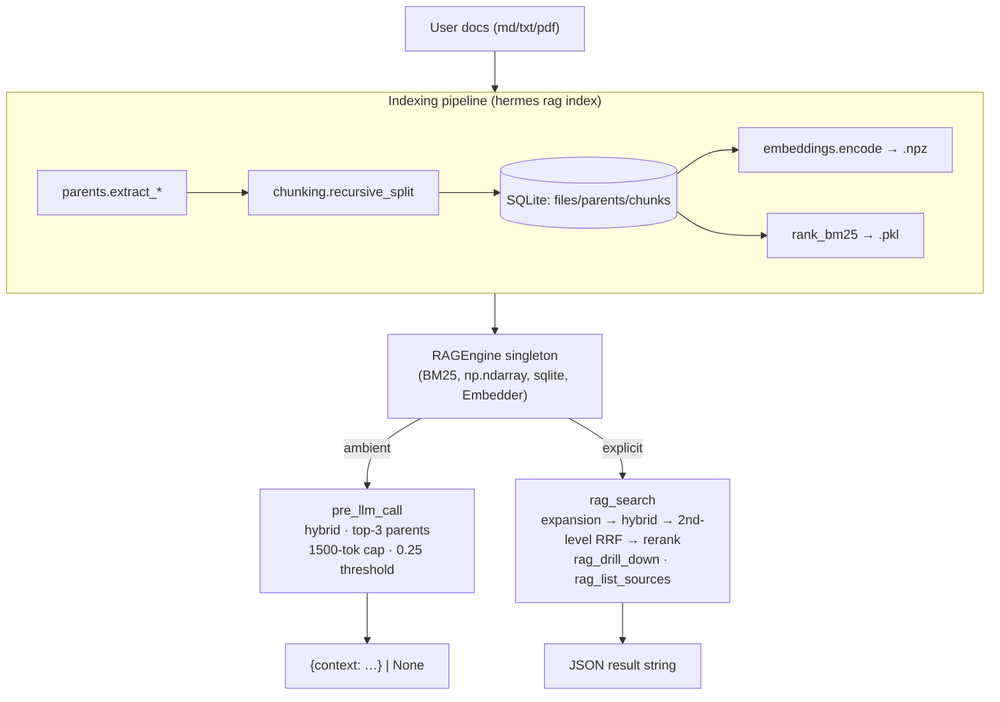

# advanced-rag

A Hermes Agent plugin for **advanced + hierarchical** retrieval-augmented
generation over local user documents (`md` / `txt` / `pdf`).

It combines two ideas:

- **Advanced RAG** — smart recursive chunking, hybrid BM25 + dense search
  fused with Reciprocal Rank Fusion (RRF), LLM query expansion (paraphrases +
  HyDE), and a reranking stage (Cohere API or local cross-encoder).
- **Hierarchical RAG** — embed small (~300-char) chunks for precise matching,
  then return the **parent unit** they belong to (markdown section, PDF page,
  or paragraph group) for rich context.

The retrieval target is **always a parent**, never a chunk. Chunks are the
search space; parents are the unit returned.

## Architecture



`rag_search` pipeline:

```
query ─► expand_query ─► [q, p1, p2, p3, hyde]
                              │
                              ▼ per variant
                         hybrid_search (BM25+dense, RRF, top-30 chunks)
                              │
                              ▼ fuse all variants
                         second-level RRF on chunk rankings → top-30
                              │
                              ▼ chunks_to_parents (MAX rollup) → ~10 parents
                              │
                              ▼ rerank (Cohere or local cross-encoder)
                              │
                              ▼ top-k
                         JSON response
```

## What the plugin exposes

- An ambient **`pre_llm_call`** hook that injects the top-3 most relevant
  parents (cap 1500 tokens) every turn, gated by a relevance threshold.
- Three tools:
  - `rag_search(query, k=5)` — full pipeline with expansion + rerank.
  - `rag_drill_down(parent_id)` — every chunk under a parent, in order.
  - `rag_list_sources()` — catalog of indexed files with parent/chunk counts.
- CLI: `hermes rag {index,stats,clear}`.
- Slash commands: `/rag`, `/rag on|off`, `/rag stats`.
- A bundled skill (`rag-usage`) teaching the agent when to use each retrieval mode.

## Install

### Dev machine (light — for running the test suite only)

```bash
python -m pip install --user numpy rank_bm25 pyyaml pytest
pytest -q
```

The dev install **does not** pull `sentence-transformers`, `pypdf`,
`anthropic`, or `cohere`. Tests stub them out.

### Runtime machine (full deps, inside Hermes' Python env)

```bash
cd ~/.hermes/plugins/hierarchical-rag && python -m pip install -r requirements.txt
```

The first explicit `rag_search` triggers MiniLM (~80 MB) and (if no Cohere
key) the cross-encoder (~80 MB) downloads.

## Deployment

Three supported flows.

### 1. Direct directory deploy via rsync (recommended)

```bash
rsync -av --delete \
  --exclude='__pycache__' --exclude='*.pyc' \
  /home/sergi/Documentos/advanced-rag/hierarchical_rag/ \
  user@runtime:~/.hermes/plugins/hierarchical-rag/

ssh user@runtime 'cd ~/.hermes/plugins/hierarchical-rag && python -m pip install -r requirements.txt'
```

The trailing slash on the source flattens contents (`plugin.yaml`, `*.py`,
`skills/`, `requirements.txt`) into the plugin dir at the layout Hermes
expects.

### 2. git clone + symlink

```bash
git clone <repo-url> ~/.hermes/plugins/hierarchical-rag-source
ln -s ~/.hermes/plugins/hierarchical-rag-source/hierarchical_rag ~/.hermes/plugins/hierarchical-rag
cd ~/.hermes/plugins/hierarchical-rag && python -m pip install -r requirements.txt
```

### 3. pip entry-point install

`pyproject.toml` declares an entry point that Hermes auto-discovers:

```toml
[project.entry-points."hermes_agent.plugins"]
hierarchical-rag = "hierarchical_rag"
```

```bash
pip install /path/to/clone
```

## Configuration

All three environment variables are optional — every one of them gracefully
degrades when unset.

| Variable | Purpose |
|---|---|
| `COHERE_API_KEY` | Optional. Enables Cohere reranker (`rerank-english-v3.0`). Without it, falls back to a local cross-encoder (~80 MB download on first use). Get one at https://dashboard.cohere.com/api-keys. |
| `ANTHROPIC_API_KEY` | Optional. Enables LLM-based query expansion (paraphrases + HyDE) via `claude-haiku-4-5`. Without it, expansion is skipped and the original query is used. Get one at https://console.anthropic.com/. |
| `HERMES_RAG_DATA_DIR` | Optional. Override the data directory (defaults to `~/.hermes/plugins/hierarchical-rag/data`). Useful for tests and isolated runs. |

The data directory is created lazily by `Store(get_data_dir())` on first
index/use. It is **not** tracked in git and is safe to delete (`hermes rag
clear`).

## Usage

```bash
# Index a corpus
hermes rag index ~/notes

# Re-index everything from scratch
hermes rag index ~/notes --force

# See counts
hermes rag stats

# Wipe the data dir (with confirmation prompt)
hermes rag clear
```

In a Hermes session:

- `/rag` — show ambient toggle state.
- `/rag on` / `/rag off` — flip the ambient context injector.
- `/rag stats` — print indexed-file counts.
- The agent autonomously calls `rag_search` / `rag_drill_down` /
  `rag_list_sources` when its skill (`rag-usage`) tells it to.

## Troubleshooting

**Cold-start latency.** The first ambient `pre_llm_call` after process start
loads MiniLM (~1–3 s on CPU). Subsequent calls are warm (~60–150 ms total).
The plugin registers an `on_session_start` hook that warms the engine in a
background thread on each new session, so the first ambient call is usually
already warm by the time it fires.

**Missing API keys.** `COHERE_API_KEY` and `ANTHROPIC_API_KEY` are both
optional. Without Cohere, reranking falls back to a local cross-encoder.
Without Anthropic, query expansion is skipped (just the original query is
used). The plugin never blocks on a missing key.

**Corrupted toggles file.** `state.is_ambient_enabled()` fails open — if
`toggles.json` can't be parsed, ambient injection stays on. Delete the file or
run `/rag on` to rewrite it.

**Indexer skips a file you changed.** The diff is keyed on `(mtime, size)`.
Touching a file without changing its size leaves the diff intact. Use
`hermes rag index <path> --force` to reprocess everything.

**PDF support missing.** `pip install pypdf` (or include the `pdf` extra).
Indexing a `.pdf` without `pypdf` raises `IndexingError` for that file but
doesn't abort the whole run.

## Repository layout

See `BUILD.md` §4 for the full layout. The Hermes-coupled surface is just
`hierarchical_rag/__init__.py::register` and `hierarchical_rag/adapters.py`.
Every other module is pure and unit-tested.

## Hermes API verification

`HERMES_API.md` documents the Hermes signatures used by the adapter layer,
verified against the Hermes source (`hermes_cli/plugins.py`, `run_agent.py`,
`agent/skill_utils.py`, `cli.py`). Any future drift only requires editing
`__init__.py` and `adapters.py`.
