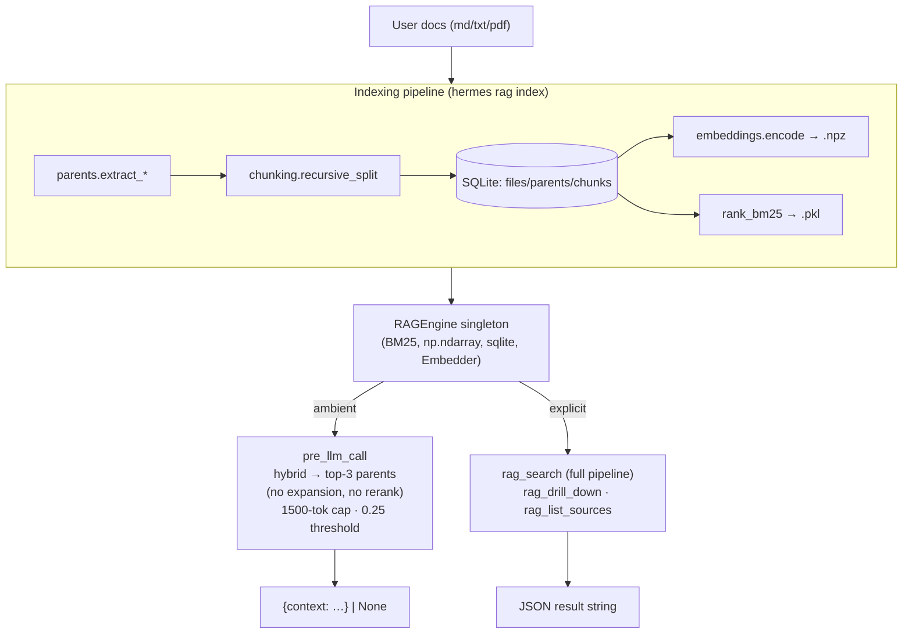

# advanced-rag

A Hermes Agent plugin for retrieval-augmented generation over local user
documents (`md` / `txt` / `pdf`).

The architecture is **parent-document retrieval** (also called *small-to-big*):
embed small (~300-char) chunks for precise matching, then return the **parent
unit** they belong to (markdown section, PDF page, or paragraph group) for
rich context. The retrieval target is always a parent; chunks are the search
space.

On top of that core, the explicit `rag_search` tool layers standard
"Advanced RAG" techniques: hybrid BM25 + dense fused with Reciprocal Rank
Fusion (RRF), LLM query expansion (paraphrases + HyDE), a second-level RRF
across expansion variants, and cross-encoder reranking (Cohere API or
local).

> **Note on "hierarchical".** The parent → chunk relationship is a single
> two-level hierarchy, not a multi-level tree. There is no recursive
> clustering or summarization tree (RAPTOR-style), no entity / knowledge
> graph (GraphRAG), no agentic / self-correcting retrieval loop, and no
> multi-hop question decomposition. The plugin is honest small-to-big with
> standard off-the-shelf advanced-RAG techniques on top — nothing more
> exotic.

## Architecture



### Two retrieval paths, not one

There are **two distinct retrieval paths**, and they are not equivalent.

**Ambient path** — `hooks.ambient_pre_llm_call`, runs every turn when the
toggle is on and the user message is ≥ 8 chars:

```
user_message ─► hybrid_search (BM25+dense, RRF, top-30 chunks)
                       │
                       ▼
                chunks_to_parents (MAX rollup) → top-3 parents
                       │
                       ▼ score ≥ 0.25 threshold
                format_context (1500-token cap) → {"context": ...}
```

No query expansion. No reranking. This is deliberate — keeping per-turn
latency low — but it means the "Advanced RAG" techniques (expansion +
rerank) only apply on the explicit tool path.

**Explicit path** — `tool_rag_search(query, k=5)`:

```
query ─► expand_query → [q, p1, p2, p3, hyde]   (Haiku; falls back to [q])
                              │
                              ▼ per variant
                         hybrid_search (BM25+dense, RRF, top-30 chunks)
                              │
                              ▼ fuse all variants
                         second-level RRF on chunk rankings → top-30
                              │
                              ▼ chunks_to_parents (MAX rollup) → ~10 parents
                              │
                              ▼ rerank (Cohere or local cross-encoder)
                              │
                              ▼ top-k
                         JSON response
```

### Techniques used (concrete, off-the-shelf)

- **Chunking:** recursive character splitter, separator cascade
  `("\n\n", "\n", ". ", " ", "")`, `max=300` chars, `overlap=50`. Not
  semantic chunking.
- **Parent extraction:** `## ` heading split for markdown (with a synthetic
  *preamble* parent for content before the first `##`, gated by
  `PREAMBLE_MIN_CHARS=200`), one parent per page for PDF, greedy paragraph
  groups of ~2000 chars for plain text.
- **Sparse retrieval:** `rank_bm25.BM25Okapi`. Same `_tokenize` used at
  index and query time (alphanumeric runs, lowercased) — critical for
  honest BM25 scoring.
- **Dense retrieval:** `sentence-transformers` MiniLM (`all-MiniLM-L6-v2`,
  384-dim, L2-normalized → cosine via dot product).
- **Fusion:** Reciprocal Rank Fusion with `k=60`, applied twice — first to
  fuse BM25 ⊕ dense within each query variant, then to fuse rankings
  across variants in the explicit path.
- **Chunk-to-parent rollup:** MAX score (not SUM/MEAN), so a parent isn't
  penalized for having other unrelated children.
- **Query expansion:** Anthropic `claude-haiku-4-5` produces up to 3
  deduped paraphrases plus one HyDE document. Gracefully degrades to `[q]`
  if SDK or API key is missing.
- **Reranking:** Cohere `rerank-english-v3.0` → local cross-encoder
  `cross-encoder/ms-marco-MiniLM-L-6-v2` → identity. The chosen reranker
  mutates `rerank_score` in place on `ParentResult`.

## What the plugin exposes

- An ambient `pre_llm_call` hook that injects the top-3 most relevant
  parents (cap 1500 tokens) every turn, gated by a 0.25 relevance
  threshold. **Hybrid retrieval only — no expansion, no rerank.**
- Three tools:
  - `rag_search(query, k=5)` — full pipeline with expansion + rerank.
  - `rag_drill_down(parent_id)` — every chunk under a parent, in order.
  - `rag_list_sources()` — catalog of indexed files with parent/chunk
    counts.
- CLI: `hermes rag {index,stats,clear}`.
- Slash commands: `/rag`, `/rag on|off`, `/rag stats`.
- A bundled skill (`rag-usage`) teaching the agent when to use each
  retrieval mode.

## Install

### Dev machine (light — for running the test suite only)

```
python -m pip install --user numpy rank_bm25 pyyaml pytest
pytest -q
```

The dev install **does not** pull `sentence-transformers`, `pypdf`,
`anthropic`, or `cohere`. Tests stub them out.

### Runtime machine (full deps, inside Hermes' Python env)

```
cd ~/.hermes/plugins/advanced-rag && python -m pip install -r requirements.txt
```

The first explicit `rag_search` triggers MiniLM (~80 MB) and (if no Cohere
key) the cross-encoder (~80 MB) downloads.

## Deployment

Three supported flows.

### 1. Direct directory deploy via rsync (recommended)

```
rsync -av --delete \
  --exclude='__pycache__' --exclude='*.pyc' \
  /home/sergi/Documentos/advanced-rag/advanced_rag/ \
  user@runtime:~/.hermes/plugins/advanced-rag/

ssh user@runtime 'cd ~/.hermes/plugins/advanced-rag && python -m pip install -r requirements.txt'
```

The trailing slash on the source flattens contents (`plugin.yaml`, `*.py`,
`skills/`, `requirements.txt`) into the plugin dir at the layout Hermes
expects.

### 2. git clone + symlink

```
git clone <repo-url> ~/.hermes/plugins/advanced-rag-source
ln -s ~/.hermes/plugins/advanced-rag-source/advanced_rag ~/.hermes/plugins/advanced-rag
cd ~/.hermes/plugins/advanced-rag && python -m pip install -r requirements.txt
```

### 3. pip entry-point install

`pyproject.toml` declares an entry point that Hermes auto-discovers:

```
[project.entry-points."hermes_agent.plugins"]
advanced-rag = "advanced_rag"
```

```
pip install /path/to/clone
```

## Configuration

All three environment variables are optional — every one of them gracefully
degrades when unset.

| Variable              | Purpose                                                                                                                                                                                                |
| --------------------- | ------------------------------------------------------------------------------------------------------------------------------------------------------------------------------------------------------ |
| `COHERE_API_KEY`      | Optional. Enables Cohere reranker (`rerank-english-v3.0`). Without it, falls back to a local cross-encoder (~80 MB download on first use). Get one at <https://dashboard.cohere.com/api-keys>.         |
| `ANTHROPIC_API_KEY`   | Optional. Enables LLM-based query expansion (paraphrases + HyDE) via `claude-haiku-4-5`. Without it, expansion is skipped and the original query is used. Get one at <https://console.anthropic.com/>. |
| `HERMES_RAG_DATA_DIR` | Optional. Override the data directory (defaults to `~/.hermes/plugins/advanced-rag/data`). Useful for tests and isolated runs.                                                                         |

The data directory is created lazily by `Store(get_data_dir())` on first
index/use. It is **not** tracked in git and is safe to delete (`hermes rag
clear`).

## Usage

```
# Index a corpus
hermes rag index ~/notes

# Re-index everything from scratch
hermes rag index ~/notes --force

# See counts
hermes rag stats

# Wipe the data dir (with confirmation prompt)
hermes rag clear
```

In a Hermes session:

- `/rag` — show ambient toggle state.
- `/rag on` / `/rag off` — flip the ambient context injector.
- `/rag stats` — print indexed-file counts.
- The agent autonomously calls `rag_search` / `rag_drill_down` /
  `rag_list_sources` when its skill (`rag-usage`) tells it to.

## Troubleshooting

**Cold-start latency.** The first ambient `pre_llm_call` after process start
loads MiniLM (~1–3 s on CPU). Subsequent calls are warm (~60–150 ms total).
The plugin registers an `on_session_start` hook that warms the engine in a
background thread on each new session, so the first ambient call is usually
already warm by the time it fires.

**Missing API keys.** `COHERE_API_KEY` and `ANTHROPIC_API_KEY` are both
optional. Without Cohere, reranking falls back to a local cross-encoder.
Without Anthropic, query expansion is skipped (just the original query is
used). The plugin never blocks on a missing key.

**Corrupted toggles file.** `state.is_ambient_enabled()` fails open — if
`toggles.json` can't be parsed, ambient injection stays on. Delete the file
or run `/rag on` to rewrite it.

**Indexer skips a file you changed.** The diff first checks `(mtime,
size)`; on a hit it falls back to a SHA-256 content hash, so an in-place
edit that preserved both fields still gets picked up. If the file is
genuinely identical (same bytes, same stat) it is skipped; otherwise
reindexed. Use `hermes rag index <path> --force` to reprocess everything
regardless.

**Markdown intro / TL;DR seems to be missing.** `extract_md` splits on
`## ` headings. Text before the first `## ` becomes a synthetic *preamble*
parent only if it has at least `PREAMBLE_MIN_CHARS` (default 200) of body
content; shorter prefixes are dropped as boilerplate. Lower the threshold
(or add a `## Overview` heading) if your intro is shorter and you want it
indexed.

**Markdown sections inside fenced code blocks.** `extract_md` is
line-oriented and not aware of fenced code blocks (` ``` ` / `~~~`), so an
unindented `##` *inside* a fenced block is treated as a section break.
Real-world Python/shell/MDX samples can trip this.

**PDF support missing.** `pip install pypdf` (or include the `pdf` extra).
Indexing a `.pdf` without `pypdf` raises `IndexingError` for that file but
doesn't abort the whole run.

## Repository layout

See `REQUIREMENTS.md` §3.2 for the full layout. The Hermes-coupled surface
is just `advanced_rag/__init__.py::register` and
`advanced_rag/adapters.py`. Every other module is pure and unit-tested.

## Hermes API verification

`HERMES_API.md` documents the Hermes signatures used by the adapter layer,
verified against the Hermes source (`hermes_cli/plugins.py`,
`run_agent.py`, `agent/skill_utils.py`, `cli.py`). Any future drift only
requires editing `__init__.py` and `adapters.py`.
