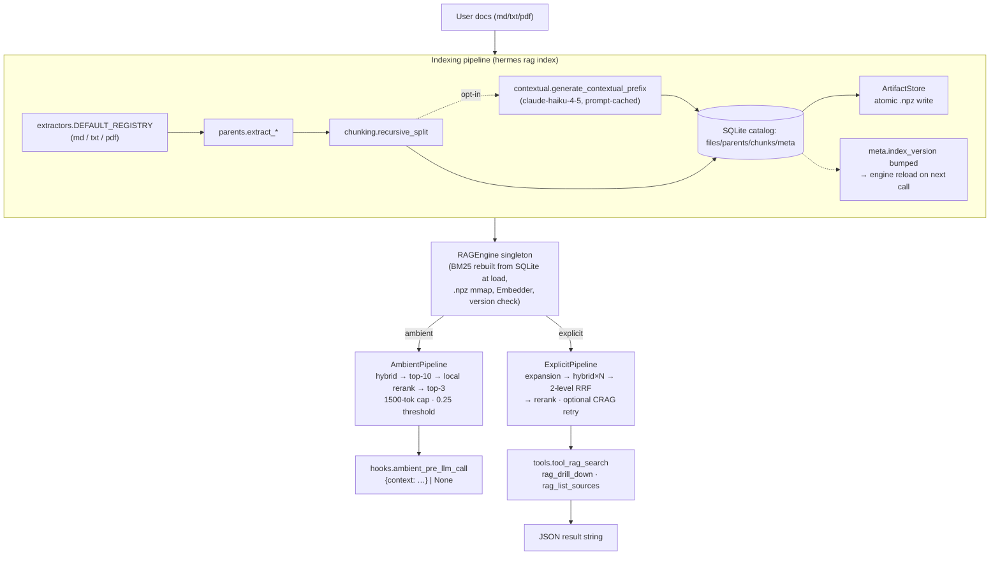

# hermes-hybrid-rag

A Hermes Agent plugin for retrieval-augmented generation over local user
documents (`md` / `txt` / `pdf`).

The architecture is **parent-document retrieval** (also called *small-to-big*):
embed small (~300-char) chunks for precise matching, then return the **parent
unit** they belong to (markdown section, PDF page, or paragraph group) for
rich context. The retrieval target is always a parent; chunks are the search
space.

On top of that core, the explicit `rag_search` tool layers standard
"Advanced RAG" techniques: hybrid BM25 + dense fused with Reciprocal Rank
Fusion (RRF), LLM query expansion (paraphrases + HyDE), a second-level RRF
across expansion variants, and cross-encoder reranking (Cohere API or
local). The ambient hook runs a lighter version of the same pipeline on
every turn (hybrid → top-10 parents → local rerank → top-3 parents).

Opt-in upgrades, each gated by a single env var: Anthropic-style
**contextual retrieval** at index time, a one-shot **CRAG-lite** critique +
retry on the explicit path, and **conversational memory** on the ambient
path.

> **Note on "hierarchical".** The parent → chunk relationship is a single
> two-level hierarchy, not a multi-level tree. There is no recursive
> clustering or summarization tree (RAPTOR-style), no entity / knowledge
> graph (GraphRAG), no agentic / self-correcting retrieval loop, and no
> multi-hop question decomposition. The plugin is honest small-to-big with
> standard off-the-shelf advanced-RAG techniques on top — nothing more
> exotic.

## Architecture



BM25 is rebuilt from SQLite on every engine load — the index is *not*
persisted as a pickle. The previous pickle path was a code-execution sink
(CWE-502) for anyone who could write the data dir; tokenization is cheap,
deserialization is forever. Indexing also unlinks any legacy `bm25.pkl`
left behind by an older install or a hostile cohabiter.

The indexing path bumps `meta.index_version` after a successful rebuild;
the engine reads that key on every `hybrid_search` and transparently
reloads on mismatch, so any writer (including future incremental
updaters) invalidates cached engine state by construction — no explicit
`engine.reset()` call required.

### Two retrieval paths, not one

There are **two distinct retrieval paths**, and they are not equivalent.

**Ambient path** — `hooks.ambient_pre_llm_call`, runs every turn when the
toggle is on and the user message is ≥ 8 chars:

```
user_message ─► hybrid_search (BM25+dense, RRF, top-30 chunks)
                       │
                       ▼
                chunks_to_parents (MAX rollup) → top-10 parents
                       │
                       ▼ local cross-encoder rerank
                       │
                       ▼ top-3 parents · score ≥ 0.25 (post-rerank)
                format_context (1500-token cap) → {"context": ...}
```

No query expansion. No Cohere call. The rerank step is intentionally
**local-only** — adding a Cohere round-trip would defeat the purpose of
the cheap injection layer. The threshold of 0.25 now applies to the
post-rerank score: cross-encoder logits are typically much higher than
RRF scores, so the threshold is mostly a "don't inject obviously
irrelevant text" guard rather than a tight filter.

When `HERMES_RAG_AMBIENT_CONVO_MEMORY=1`, the query embedding is mixed
with the previous 1–2 user turns' embeddings before dense search (BM25
still operates on the literal current message). Helps with follow-ups
("explain more about that"); contaminates retrieval when the user
switches topic. Off by default.

**Explicit path** — `tool_rag_search(query, k=5)`:

```
query ─► expand_query → [q, p1, p2, p3, hyde]   (Haiku; falls back to [q])
                              │
                              ▼ per variant
                         hybrid_search (BM25+dense, RRF, top-30 chunks)
                              │
                              ▼ fuse all variants
                         second-level RRF on chunk rankings → top-30
                              │
                              ▼ chunks_to_parents (MAX rollup) → ~10 parents
                              │
                              ▼ rerank (Cohere or local cross-encoder)
                              │
                              ▼ top-k
                         [optional, HERMES_RAG_CRAG=1]
                         crag.judge_retrieval → sufficient? ✓ return
                                              insufficient → reformulate
                                                           → re-run pipeline (one retry)
                              │
                              ▼
                         JSON response
```

JSON shape:

```json
{
  "results": [{"parent_id": …, "title": …, "text": …, …}, …],
  "expansions_used": 5,
  "crag_reformulated_query": "string or null",
  "crag_reason": "string or null"
}
```

`crag_*` fields are `null` unless CRAG-lite ran and surfaced a verdict.

### Techniques used (concrete, off-the-shelf)

- **Chunking:** recursive character splitter, separator cascade
  `("\n\n", "\n", ". ", " ", "")`, `max=300` chars, `overlap=50`. Not
  semantic chunking.
- **Parent extraction:** `## ` heading split for markdown (with a synthetic
  *preamble* parent for content before the first `##`, gated by
  `PREAMBLE_MIN_CHARS=200`), one parent per page for PDF, greedy paragraph
  groups of ~2000 chars for plain text.
- **Sparse retrieval:** `rank_bm25.BM25Okapi`. Same `_tokenize` used at
  index and query time (alphanumeric runs, lowercased) — critical for
  honest BM25 scoring. Always present, regardless of which dense model is
  configured.
- **Dense retrieval:** `sentence-transformers` with `BAAI/bge-m3` by
  default (multilingual, 1024-dim, L2-normalized → cosine via dot
  product). Swap via `HERMES_RAG_EMBED_MODEL=<id>` — any model the SDK can
  load works. The indexer pins the model name/dim in SQLite `meta`; on
  load the engine refuses dim mismatch (`EngineLoadError`) and warns on
  same-dim model drift.
- **Contextual retrieval (opt-in):** when `HERMES_RAG_CONTEXTUAL=1`, each
  chunk receives a 50–100 token prefix generated by `claude-haiku-4-5`
  that locates the chunk inside its parent. Both BM25 and the dense index
  store `prefix + chunk`. The parent text rides in a `cache_control:
  ephemeral` block so all chunks of one parent share a single
  prompt-cache entry. Anthropic failures → prefix stays NULL for that
  chunk, run continues.
- **Fusion:** Reciprocal Rank Fusion with `k=60`, applied twice — first to
  fuse BM25 ⊕ dense within each query variant, then to fuse rankings
  across variants in the explicit path.
- **Chunk-to-parent rollup:** MAX score (not SUM/MEAN), so a parent isn't
  penalized for having other unrelated children.
- **Query expansion:** Anthropic `claude-haiku-4-5` produces up to 3
  deduped paraphrases plus one HyDE document. Gracefully degrades to `[q]`
  if SDK or API key is missing.
- **Reranking — explicit path:** Cohere `rerank-english-v3.0` → local
  cross-encoder `cross-encoder/ms-marco-MiniLM-L-6-v2` → identity. The
  chosen reranker returns fresh `ParentResult` copies with `rerank_score`
  populated (`dataclasses.replace`); the caller's input list is never
  mutated, so A/B reranking the same parents through different scorers
  doesn't leak state across calls.
- **Reranking — ambient path:** local cross-encoder → identity only.
  Cohere is intentionally skipped on the per-turn path so latency stays
  bounded.
- **CRAG-lite (opt-in):** when `HERMES_RAG_CRAG=1`, the explicit path
  feeds its parents to a `claude-haiku-4-5` judge. If the verdict is
  "insufficient", the query is reformulated once and the pipeline runs
  again. Hard cap: exactly one retry, never a second critique.
- **Ambient conversational memory (opt-in):** when
  `HERMES_RAG_AMBIENT_CONVO_MEMORY=1`, the dense-side query vector is the
  L2-normalized linear combination of the current and previous 1–2 user-
  turn embeddings (weights `1.0 / 0.25 / 0.1`, normalized). BM25 still
  tokenizes the literal current message. In-memory ring buffer per
  session.

## What the plugin exposes

- An ambient `pre_llm_call` hook that injects the top-3 most relevant
  parents (cap 1500 tokens) every turn, gated by a 0.25 relevance
  threshold. Hybrid retrieval → top-10 → **local cross-encoder rerank**
  → top-3. No query expansion. No Cohere call.
- Three tools:
  - `rag_search(query, k=5)` — full pipeline with expansion + rerank.
  - `rag_drill_down(parent_id)` — every chunk under a parent, in order.
  - `rag_list_sources()` — catalog of indexed files with parent/chunk
    counts.
- CLI: `hermes rag {index,stats,clear}`.
- Slash commands: `/rag`, `/rag on|off`, `/rag stats`.
- A bundled skill (`rag-usage`) teaching the agent when to use each
  retrieval mode.

## Install

### Dev machine (light — for running the test suite only)

```
python -m pip install --user numpy rank_bm25 pyyaml pytest
pytest -q
```

The dev install **does not** pull `sentence-transformers`, `pypdf`,
`anthropic`, or `cohere`. Tests stub them out.

### Runtime machine (full deps, inside Hermes' Python env)

```
cd ~/.hermes/plugins/hybrid-rag && python -m pip install -r requirements.txt
```

On a fresh machine the first session warm-up (and any subsequent cold
load) downloads:

- the configured dense model — `BAAI/bge-m3` by default, ~2.2 GB; the
  alternative `sentence-transformers/all-MiniLM-L6-v2` is ~80 MB,
- the local cross-encoder `cross-encoder/ms-marco-MiniLM-L-6-v2`, ~80 MB
  (warmed alongside the dense model in `on_session_start` so the first
  ambient rerank is hot).

## Deployment

Three supported flows.

### 1. Direct directory deploy via rsync (recommended)

```
rsync -av --delete \
  --exclude='__pycache__' --exclude='*.pyc' \
  /home/sergi/Documentos/hybrid-rag/hybrid_rag/ \
  user@runtime:~/.hermes/plugins/hybrid-rag/

ssh user@runtime 'cd ~/.hermes/plugins/hybrid-rag && python -m pip install -r requirements.txt'
```

The trailing slash on the source flattens contents (`plugin.yaml`, `*.py`,
`skills/`, `requirements.txt`) into the plugin dir at the layout Hermes
expects.

### 2. git clone + symlink

```
git clone <repo-url> ~/.hermes/plugins/hybrid-rag-source
ln -s ~/.hermes/plugins/hybrid-rag-source/hybrid_rag ~/.hermes/plugins/hybrid-rag
cd ~/.hermes/plugins/hybrid-rag && python -m pip install -r requirements.txt
```

### 3. pip entry-point install

`pyproject.toml` declares an entry point that Hermes auto-discovers:

```
[project.entry-points."hermes_agent.plugins"]
hybrid-rag = "hybrid_rag"
```

```
pip install /path/to/clone
```

## Configuration

Every environment variable is optional — each one gracefully degrades when
unset.

| Variable                          | Purpose                                                                                                                                                                                                                                                  |
| --------------------------------- | -------------------------------------------------------------------------------------------------------------------------------------------------------------------------------------------------------------------------------------------------------- |
| `COHERE_API_KEY`                  | Enables Cohere reranker (`rerank-english-v3.0`) on the **explicit** path. Falls back to a local cross-encoder (~80 MB on first use) when unset. The ambient path never calls Cohere. Get one at <https://dashboard.cohere.com/api-keys>.                 |
| `ANTHROPIC_API_KEY`               | Enables LLM features that depend on Anthropic: query expansion, contextual retrieval (Phase 2), CRAG-lite (Phase 4). Without it, each feature silently degrades. Get one at <https://console.anthropic.com/>.                                            |
| `HERMES_RAG_DATA_DIR`             | Override the data directory (defaults to `~/.hermes/plugins/hybrid-rag/data`). Useful for tests and isolated runs.                                                                                                                                     |
| `HERMES_RAG_EMBED_MODEL`          | Override the sentence-transformers model id. Defaults to `BAAI/bge-m3` (multilingual, 1024-d). Any model id the SDK can load works (e.g. `sentence-transformers/all-MiniLM-L6-v2`). **Switching models requires `hermes rag index --force`** — the dim won't match the on-disk `.npz` otherwise; the engine refuses to load with a clear error pointing at `--force`. |
| `HERMES_RAG_EMBED_DIM`            | Manually pin the embedding dimension. Almost never needed: the dim is auto-detected on first model load (for unknown ids) or read from a built-in table (for known ones).                                                                               |
| `HERMES_RAG_CONTEXTUAL`           | Set to `1` to enable Anthropic-style **Contextual Retrieval** (Phase 2). At index time, each chunk gets a 50–100-token prefix locating it in its parent; both BM25 and the dense index store `prefix + chunk`. Costs Anthropic tokens per indexed chunk (prompt caching keeps it cheap). Without it, behavior matches v0.1. |
| `HERMES_RAG_AMBIENT_CONVO_MEMORY` | Set to `1` to mix the current query embedding with the previous 1–2 user-turn embeddings in the **ambient** path only. Helps with follow-ups ("explain more about that"); contaminates retrieval when the user changes topic — that's why it is off by default. |
| `HERMES_RAG_CRAG`                 | Set to `1` to enable **CRAG-lite** (Phase 4) on the explicit `rag_search` path: after retrieval an LLM critiques the parents; if insufficient, the query is reformulated and retrieval runs once more (hard-capped at one retry). Robustness layer, not a replacement for better retrieval — enable after Phase 2 (Contextual Retrieval). |

The data directory is created lazily by `Store(get_data_dir())` on first
index/use. It is **not** tracked in git and is safe to delete (`hermes rag
clear`).

### Embedding model trade-offs

- The default `BAAI/bge-m3` is multilingual and ~2.2 GB on disk; first index
  on a fresh machine downloads it. Quality is meaningfully better than
  MiniLM on cross-lingual and long-tail vocabulary.
- For an English-only corpus on a low-RAM machine, set
  `HERMES_RAG_EMBED_MODEL=sentence-transformers/all-MiniLM-L6-v2`
  (~80 MB, 384-d) and reindex. Quality regresses but the runtime footprint
  drops dramatically.
- BM25 is **always** kept as the sparse path regardless of the model — it's
  the only thing keeping lexical-match queries (acronyms, code symbols, exact
  phrases) from falling off the dense index.

## Usage

```
# Index a corpus
hermes rag index ~/notes

# Re-index everything from scratch
hermes rag index ~/notes --force

# See counts
hermes rag stats

# Wipe the data dir (with confirmation prompt)
hermes rag clear
```

In a Hermes session:

- `/rag` — show ambient toggle state.
- `/rag on` / `/rag off` — flip the ambient context injector.
- `/rag stats` — print indexed-file counts.
- The agent autonomously calls `rag_search` / `rag_drill_down` /
  `rag_list_sources` when its skill (`rag-usage`) tells it to.

## Troubleshooting

**Cold-start latency.** The first ambient `pre_llm_call` after process
start loads the dense embedder (1–10 s on CPU depending on whether you've
kept the default `BAAI/bge-m3` or swapped to MiniLM) plus the local
cross-encoder (~1–2 s). Subsequent calls are warm — the engine + rerank
budget is ~80–200 ms total. The plugin registers an `on_session_start`
hook that warms **both** models in a background thread on each new
session, so the first ambient call is usually already warm by the time it
fires.

**Missing API keys.** All API keys are optional. Without `COHERE_API_KEY`,
explicit-path reranking falls back to the local cross-encoder. Without
`ANTHROPIC_API_KEY`, query expansion returns `[query]`, contextual
retrieval (`HERMES_RAG_CONTEXTUAL=1`) records every chunk's prefix as
NULL, and CRAG-lite (`HERMES_RAG_CRAG=1`) becomes a no-op (judge always
returns "sufficient"). The plugin never blocks on a missing key.

**Embedding dim mismatch on load.** If you've switched
`HERMES_RAG_EMBED_MODEL` (or your env disagrees with the dim baked into a
prior `.npz`), the engine refuses to load with `EngineLoadError:
embeddings.npz dim N disagrees with stored meta dim M — re-run
\`hermes rag index <path> --force\`.` Do exactly that — a stale `.npz`
under a new dense model produces silent garbage retrieval, which is
worse.

**Embedding-model drift warning.** If the configured model id differs
from the one written into SQLite `meta` at the last index, the engine
logs a `WARNING` (`embedding-model drift: index was built with X but the
current configuration is Y`) and keeps serving. Dim happens to match, so
retrieval still works, but you'll often get better results after `hermes
rag index --force` rebuilds with the new model.

**Corrupted toggles file.** `state.is_ambient_enabled()` fails open — if
`toggles.json` can't be parsed, ambient injection stays on. Delete the
file or run `/rag on` to rewrite it.

**Indexer skips a file you changed.** The diff first checks `(mtime,
size)`; on a hit it falls back to a SHA-256 content hash, so an in-place
edit that preserved both fields still gets picked up. If the file is
genuinely identical (same bytes, same stat) it is skipped; otherwise
reindexed. Use `hermes rag index <path> --force` to reprocess everything
regardless.

**Markdown intro / TL;DR seems to be missing.** `extract_md` splits on
`## ` headings. Text before the first `## ` becomes a synthetic *preamble*
parent only if it has at least `PREAMBLE_MIN_CHARS` (default 200) of body
content; shorter prefixes are dropped as boilerplate. Lower the threshold
(or add a `## Overview` heading) if your intro is shorter and you want it
indexed.

**Markdown sections inside fenced code blocks.** `extract_md` is
line-oriented and not aware of fenced code blocks (` ``` ` / `~~~`), so an
unindented `##` *inside* a fenced block is treated as a section break.
Real-world Python/shell/MDX samples can trip this.

**PDF support missing.** `pip install pypdf` (or include the `pdf` extra).
Indexing a `.pdf` without `pypdf` raises `IndexingError` for that file but
doesn't abort the whole run.

## Repository layout

The Hermes-coupled surface is exactly two files: `hybrid_rag/__init__.py`
(`register(ctx)`) and `hybrid_rag/adapters.py` (closures that match
Hermes's calling shape). Everything else is pure and unit-tested.

Inside the package, modules group into discrete layers — each with one
reason to change:

| Layer | Modules | Role |
| --- | --- | --- |
| Hermes coupling | `__init__.py`, `adapters.py`, `schemas.py` | The only place Hermes API drift can break things. |
| Surface (JSON / event shells) | `tools.py`, `hooks.py`, `slash.py`, `cli.py` | Thin wrappers; never raise into Hermes. |
| Pipelines | `pipelines.py` | `ExplicitPipeline` (rag_search) and `AmbientPipeline` (per-turn) — shared shape lives here, not duplicated in the surfaces. |
| Optional feature modules | `expansion.py`, `crag.py`, `contextual.py`, `convo.py` | Each opt-in via one env var; degrade silently when the SDK / API key is missing. |
| Retrieval primitives | `retrieval.py`, `formatting.py`, `rerank.py` | Hybrid search, RRF, MAX rollup; prompt-injection-safe presentation; reranker cascade. |
| Engine | `engine.py`, `validation.py` | Process singleton holding BM25 + `.npz` + chunk ids; exposes `hybrid_search` so callers never touch `_ensure_loaded`. |
| Storage | `storage.py`, `artifacts.py`, `manifest.py` | SQLite catalog, atomic `.npz` I/O, filesystem ↔ catalog diff — three classes, three reasons to change. |
| Indexing | `indexing.py`, `extractors.py`, `parents.py`, `chunking.py`, `embeddings.py` | Walk → diff → extract → chunk → embed → write. New file types register through `ExtractorRegistry`. |
| Cross-cutting | `models.py`, `protocols.py`, `config.py`, `state.py`, `_anthropic.py` | Data classes, typing contracts, paths + cross-cutting tunables, ambient toggle, shared Anthropic client. |

`REQUIREMENTS.md` §3.2 carries the full per-file responsibilities + invariants.

## Hermes API verification

`HERMES_API.md` documents the Hermes signatures used by the adapter layer,
verified against the Hermes source (`hermes_cli/plugins.py`,
`run_agent.py`, `agent/skill_utils.py`, `cli.py`). Any future drift only
requires editing `__init__.py` and `adapters.py`.
