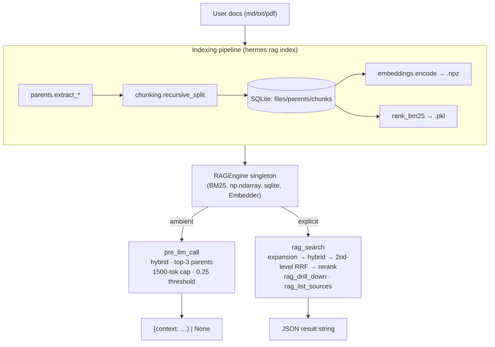

# REQUIREMENTS.md — `advanced-rag` Hermes plugin

This document is the authoritative specification for the `advanced-rag` plugin and a self-contained reference for what any Hermes Agent plugin must provide.

Companion docs:

- `README.md` — install, usage, deployment, troubleshooting (user-facing).
- `HERMES_API.md` — verified Hermes plugin signatures with source-line citations.
- `CLAUDE.md` — agent guidance and architectural guardrails for working in this repo.

This file deliberately does not repeat install commands or signature minutiae. When a requirement here references a Hermes API, see `HERMES_API.md` for the exact shape.

---

## 1. Overview

The plugin combines two RAG techniques over local user documents (`md` / `txt` / `pdf`):

- **Advanced RAG** — smart recursive chunking, hybrid BM25 + dense search fused via Reciprocal Rank Fusion (RRF), LLM-based query expansion (paraphrases + HyDE), and reranking (Cohere API or local cross-encoder).
- **Hierarchical RAG** — embed small (~300-char) chunks for precise matching, but return their **parent units** (markdown sections, PDF pages, paragraph groups) for rich context.

Surfaces exposed:

- An ambient `pre_llm_call` hook that injects the top-3 most relevant parents (cap 1500 tokens) every turn, gated by a relevance threshold.
- An `on_session_start` hook that warms the engine in a background thread.
- Three tools: `rag_search` (full pipeline), `rag_drill_down` (chunks of a parent), `rag_list_sources` (catalog).
- CLI: `hermes rag {index,stats,clear}`.
- Slash commands: `/rag`, `/rag on|off`, `/rag stats`.
- A bundled skill (`rag-usage`) teaching the agent when to use each retrieval mode.

The retrieval target is **always a parent**, never a chunk. Chunks are the search space; parents are the unit returned.

---

## 2. General Hermes Agent Plugin Requirements

Anything below applies to every Hermes plugin, not just this one. Verified signatures live in `HERMES_API.md`.

### 2.1 Discovery and packaging

A Hermes plugin is discovered by one of two paths (later overrides earlier on key collision: bundled → user → project → entry-point):

1. **Filesystem** — a directory under `~/.hermes/plugins/<dirname>/` containing:
   - `plugin.yaml` — manifest (see §2.2).
   - `__init__.py` — must export a `register(ctx) -> None` function.
2. **Entry point** — a Python package declaring the entry point group `hermes_agent.plugins`:
   ```toml
   [project.entry-points."hermes_agent.plugins"]
   <plugin-name> = "<python_package>"
   ```
   The named package must export `register`.

Either path leads to the same contract: Hermes calls `register(ctx)` once per process, passing a `PluginContext`. The plugin uses `ctx.register_*` methods to wire its surfaces. There is no class-based interface; `register(ctx)` is the entire entry point.

### 2.2 `plugin.yaml` manifest

Required key: `name` (must match the dirname for filesystem discovery, e.g., `advanced-rag`).

Recommended keys: `version`, `description`, `author`, `kind` (defaults to `standalone`; alternatives: `backend`, `exclusive`, `platform`).

Advisory keys (used for `hermes plugin list`, not for actual wiring):

- `provides_tools: [str, ...]`
- `provides_hooks: [str, ...]`
- `requires_env: [str, ...]` — the dataclass also accepts dicts but no consumer reads dict fields; convention is plain strings, with full docs in the README.

Real registration happens in `register(ctx)`; the manifest is metadata only.

### 2.3 The `ctx.register_*` surface

Every plugin uses some subset of these. Exact signatures with source-line citations are in `HERMES_API.md`; this section gives the contract a plugin must satisfy.

**`ctx.register_tool(name, toolset, schema, handler, ...)`** — exposes a tool callable by the agent.

- `schema` is a JSON Schema dict: `{"name", "description", "parameters": {...}}`.
- `handler(args: dict, **kwargs) -> str` — must return a JSON string. Tools should never raise; wrap the body in `try/except` and return a JSON-encoded error.
- Optional kwargs: `check_fn` (gate availability), `requires_env` (env vars that must be set), `is_async`, `description`, `emoji`.

**`ctx.register_hook(hook_name, callback)`** — wires into a Hermes lifecycle event. Hermes calls `callback(**kwargs)`. Hooks must never raise — wrap the body in `try/except` and return a benign default (typically `None`).

Valid hook names: `pre_tool_call`, `post_tool_call`, `transform_terminal_output`, `transform_tool_result`, `pre_llm_call`, `post_llm_call`, `pre_api_request`, `post_api_request`, `on_session_start`, `on_session_end`, `on_session_finalize`, `on_session_reset`, `subagent_stop`, `pre_gateway_dispatch`, `pre_approval_request`, `post_approval_response`.

The two used by this plugin:

- `pre_llm_call` — fires every turn before the LLM call. Kwargs: `session_id`, `user_message`, `conversation_history`, `is_first_turn`, `model`, `platform`, `sender_id`. Return `None` to inject nothing, or `{"context": "<text>"}` (or a plain string — equivalent) to inject. Hermes always injects context into the user message, never the system prompt (preserves prompt-cache prefix). Injection is ephemeral, not persisted.
- `on_session_start` — fires only on brand-new sessions (not continuations). Kwargs: `session_id`, `model`, `platform`. Used here to warm the engine in a background thread.

**`ctx.register_cli_command(name, help, setup_fn, handler_fn=None)`** — adds a top-level `hermes <name>` subcommand.

- `setup_fn(parser: argparse.ArgumentParser) -> None` — adds args/sub-commands.
- `handler_fn(args: argparse.Namespace) -> int` — returns an exit code. Optional; if provided, Hermes wires it via `parser.set_defaults(func=handler_fn)`.

**`ctx.register_command(name, handler, description="", args_hint="")`** — adds a `/<name>` slash command available inside Hermes sessions.

- `handler(raw_args: str) -> str | None` — **single positional arg, no kwargs**. There is no `session_id` here, so per-session state is impossible at this layer; use a process-global toggle or persistent file state.
- `args_hint` (e.g., `"on|off|stats"`) is shown as the parameter field in gateway adapters such as Discord's slash-command picker.

**`ctx.register_skill(name, path, description="")`** — registers a markdown skill file teaching the agent how/when to use the plugin.

- `path` must be a `pathlib.Path`, **not** a string. The implementation calls `path.exists()`; passing `str` raises `AttributeError`.
- Skill name constraint: `[a-zA-Z0-9_-]+`, no `:`. Hermes prefixes the plugin name to form a qualified id like `advanced-rag:rag-usage`.
- The `SKILL.md` file's frontmatter keys actually consumed by Hermes: `name` (defaults to dir name), `description`, `platforms` (optional list, e.g., `[linux, macos]`), `metadata` (optional nested dict).

### 2.4 Pure core / thin adapter separation (architectural rule)

Hermes' API can shift between versions. To localize the blast radius, every Hermes-coupled surface must be a thin closure that imports the pure handler lazily and reshapes signatures. Pure modules must not import Hermes or take its argument shapes (e.g., `**kwargs`, `dict | None` returns).

When Hermes signatures drift, the fix lives in `__init__.py::register` and `adapters.py` only.

### 2.5 Hooks must never raise

Any unhandled exception in a hook risks aborting the user's turn or failing session start. Every hook must wrap its entire body in `try/except Exception: return <benign default>`. Tools follow the same rule but return JSON-encoded errors instead.

### 2.6 Idempotent, deferred state

Plugins must not write to disk at import time, at `register(ctx)` time, or in any code path that runs on the dev machine during tests. Runtime state is created lazily on first use, in a directory that can be overridden via env var so tests are isolated from real user data.

---

## 3. `advanced-rag` plugin requirements

### 3.1 Architecture



Module boundaries:

- **Pure modules** (no Hermes import, unit-tested directly): `chunking.py`, `parents.py`, `storage.py`, `embeddings.py`, `indexing.py`, `retrieval.py`, `expansion.py`, `rerank.py`, `contextual.py`, `crag.py`, `engine.py`, `state.py`, `hooks.py`, `tools.py`, `schemas.py`, `cli.py`, `slash.py`, `config.py`.
- **Hermes-coupled surface** (only files to edit if Hermes' API drifts): `__init__.py::register(ctx)` and `adapters.py`.

### 3.2 Project layout (deployable artifact)

```
/home/sergi/Documentos/advanced-rag/
├── advanced_rag/                       # deployable plugin payload (rsync target)
│   ├── plugin.yaml                     # Hermes manifest
│   ├── requirements.txt                # COPY of repo-root file
│   ├── __init__.py                     # register(ctx)
│   ├── adapters.py                     # closures wrapping pure handlers
│   ├── config.py                       # paths + tunables
│   ├── chunking.py                     # recursive_split
│   ├── parents.py                      # extract_md/txt/pdf, _enforce_parent_cap
│   ├── storage.py                      # Store class — sqlite + npz + pickle
│   ├── embeddings.py                   # Embedder (lazy MiniLM)
│   ├── indexing.py                     # index_path, _index_file, manifest diff
│   ├── retrieval.py                    # hybrid_search, rrf_fuse, chunks_to_parents
│   ├── expansion.py                    # expand_query (Anthropic SDK + fallback)
│   ├── rerank.py                       # rerank (Cohere or local cross-encoder)
│   ├── engine.py                       # RAGEngine singleton, get_engine()
│   ├── state.py                        # file-backed ambient toggle
│   ├── hooks.py                        # ambient_pre_llm_call(...)
│   ├── tools.py                        # tool_rag_search/drill_down/list_sources
│   ├── schemas.py                      # JSON Schema dicts for the three tools
│   ├── cli.py                          # setup_rag_parser, handle_rag
│   ├── slash.py                        # slash_rag dispatcher
│   └── skills/rag-usage/SKILL.md
└── tests/                              # pure-module unit tests, no heavy deps
```

Repo-root files: `pyproject.toml`, `requirements.txt`, `README.md`, `REQUIREMENTS.md` (this file), `HERMES_API.md`, `CLAUDE.md`, `.gitignore`, `LICENSE`.

The `data/` directory is gitignored; runtime state never appears in the repo.

`advanced_rag/requirements.txt` is a **deliberate copy** of the root file so a single `rsync -av advanced_rag/ ...` carries deps to the runtime machine. If you change one, change the other.

### 3.3 Tools

Each tool's body must be wrapped in `try/except Exception as e: return json.dumps({"error": str(e), "type": type(e).__name__})`. Tools never raise.

#### `rag_search(query: str, k: int = 5) -> str`

JSON Schema:

```python
{
    "name": "rag_search",
    "description": "Deep search of indexed user documents. Runs query expansion (paraphrases + HyDE), hybrid BM25+dense retrieval with second-level RRF fusion, parent rollup, and reranking. Returns ranked parent units with text and metadata.",
    "parameters": {
        "type": "object",
        "properties": {
            "query": {"type": "string", "description": "Natural-language query."},
            "k":     {"type": "integer", "description": "Number of parents to return.", "default": 5},
        },
        "required": ["query"],
    },
}
```

Pipeline:

```
query ─► expand_query ─► [q, p1, p2, p3, hyde]
                              │
                              ▼ per variant
                         hybrid_search (BM25+dense, RRF, top-30 chunks)
                              │
                              ▼ fuse all variants
                         second-level RRF on chunk rankings → top-30
                              │
                              ▼ chunks_to_parents (MAX rollup) → ~10 parents
                              │
                              ▼ rerank (Cohere → local cross-encoder → identity)
                              │
                              ▼ top-k
                         JSON response
```

Return shape:

```json
{
  "results": [
    {"parent_id": int, "title": str|null, "source_path": str, "score": float,
     "rerank_score": float|null, "text": str, "page_no": int|null},
    ...
  ],
  "expansions_used": int,
  "crag_reformulated_query": str|null,
  "crag_reason": str|null
}
```

`crag_reformulated_query` is set only when CRAG-lite (Phase 4) was enabled, judged the first pass insufficient, and successfully reformulated the query. `crag_reason` carries the judge's one-line explanation when CRAG ran (even when no retry was triggered, e.g. judge call failed). Both fields are `null` when CRAG is disabled.

The second-level RRF must fuse **chunk** rankings (not parent rankings) so the fusion benefits from all matched evidence; the parent rollup happens once afterward.

#### `rag_drill_down(parent_id: int) -> str`

```python
{
    "name": "rag_drill_down",
    "description": "Fetch the full ordered chunk list for a specific parent unit. Use after rag_search returned a promising parent and you need finer-grained text.",
    "parameters": {
        "type": "object",
        "properties": {"parent_id": {"type": "integer", "description": "Parent ID returned by a previous rag_search call."}},
        "required": ["parent_id"],
    },
}
```

Returns `{"parent": {...}, "chunks": [...]}`, chunks ordered by `ord`.

#### `rag_list_sources() -> str`

```python
{
    "name": "rag_list_sources",
    "description": "List all indexed source documents with their parent and chunk counts. Useful to confirm coverage before deciding whether the corpus contains an answer.",
    "parameters": {"type": "object", "properties": {}},
}
```

Returns `{"sources": [{"path", "filetype", "indexed_at", "parent_count", "chunk_count"}, ...]}`.

### 3.4 Hooks

#### `pre_llm_call` — ambient context injection

Cheap rejects (return `None`):

- Ambient toggle disabled (`state.is_ambient_enabled(session_id)` is `False`).
- `len(user_message.strip()) < 8`.
- Engine has no embeddings loaded.
- `hybrid_search` returns no hits.
- Top parent's **post-rerank** score is below `AMBIENT_SCORE_THRESHOLD`.

Otherwise (Phase 3 pipeline): `chunks_to_parents` → top `AMBIENT_RERANK_POOL` (=10) → `rerank.rerank_local` (local cross-encoder; never Cohere) → top `AMBIENT_TOP_PARENTS` (=3) → `format_context` capped at `AMBIENT_TOKEN_CAP` (=1500 tokens) → return `{"context": <text>}`.

When `HERMES_RAG_AMBIENT_CONVO_MEMORY=1`, the dense-side query vector is the L2-normalized linear combination of the current and previous 1–2 user-turn embeddings (weights default `1.0 / 0.25 / 0.1`, normalized). BM25 always tokenizes the literal current message — lexical search stays uncontaminated.

The full body is wrapped in `try/except Exception: return None`. Hooks must never raise.

Performance budget (warm, after first lazy load):

| Step | Budget |
|---|---|
| `state.is_ambient_enabled` (cached 1s) | <1 ms |
| Heuristic chitchat reject | <1 ms |
| Bi-encoder query embed (CPU, MiniLM) | 30–80 ms |
| BM25 scoring | 5–30 ms |
| Cosine over embeddings | 5–20 ms |
| Top-k argpartition × 2 | <5 ms |
| RRF + parent rollup | <5 ms |
| SQLite parent fetch (3 rows) | <5 ms |
| Format + truncate | <5 ms |
| **Total warm** | **~60–150 ms** |

Cold first call after process start is dominated by MiniLM weight load (~1–3 s on CPU). The `on_session_start` hook mitigates this.

#### `on_session_start` — engine warm

Spawns a daemon thread that calls `engine._ensure_loaded()`. Never blocks session start. Any exception is swallowed (cold load on first ambient call is the fallback).

### 3.5 CLI commands

`hermes rag index <path> [--force]`:

1. Walk files matching `*.md`, `*.txt`, `*.pdf` under `path`.
2. Compute `(mtime, size)` cheap diff via `Store.manifest_diff` → `{unchanged, changed, new, deleted}`.
3. Hash only on miss/change.
4. Delete obsolete file rows (cascade kills parents and chunks via SQL FK).
5. For each new/changed file: `parents.extract_*` → `_enforce_parent_cap` → `chunking.recursive_split` per parent → bulk insert files → parents → chunks.
6. Rebuild the whole `embeddings.npz` and `bm25.pkl` from canonical SQLite chunk ordering (`SELECT ... ORDER BY parent_id, ord`).
7. Atomic rename `.npz.tmp` → `.npz` and `.pkl.tmp` → `.pkl`.
8. `engine.reset()` so subsequent queries see the new index.
9. Print and return summary `{files, parents, chunks, skipped, ...}` and exit 0. Any exception → log and exit 2.

`hermes rag stats`:

Print `Store.stats()` (file/parent/chunk counts) and exit 0.

`hermes rag clear`:

Confirmation prompt; if confirmed, `shutil.rmtree(get_data_dir())` and exit 0. If declined, exit 1.

### 3.6 Slash commands

`slash_rag(rest: str) -> str`:

- `""` → return current ambient toggle state + brief help.
- `"on"` → `state.set_ambient(True)`; return `"Ambient RAG: on"`.
- `"off"` → `state.set_ambient(False)`; return `"Ambient RAG: off"`.
- `"stats"` → return formatted `Store.stats()`.
- anything else → return help string.

Per-session toggle is **not** supported because the slash handler signature has no `session_id` (see §2.3). Only a process-global `_default` key is settable.

### 3.7 Skill (`rag-usage`)

A `SKILL.md` file under `advanced_rag/skills/rag-usage/` with frontmatter:

```yaml
---
name: rag-usage
description: <one-line agent-facing description>
---
```

The body teaches the agent:

- Read ambient context first; don't redundantly call tools when the answer is already injected.
- Call `rag_search` for research-style questions, cross-document comparisons, or when ambient is missing/insufficient.
- Call `rag_drill_down` when a promising parent surfaces and finer text is needed.
- Call `rag_list_sources` to confirm coverage before claiming the corpus doesn't cover something.
- Cite as `(<basename>, <title-or-page>)`.
- Stop after two consecutive empty searches and tell the user.

### 3.8 Indexing requirements

Supported extensions: `.md`, `.txt`, `.pdf`. Other extensions are skipped silently.

Parent kinds:

- `extract_md` — split on level-2 (`## `) lines; each parent's title is the literal heading line; `kind="section"`. If zero level-2 headings, defer to `extract_txt`.
- `extract_txt` — paragraph groups by `\n\s*\n`; greedy-pack to ~2000 chars; `kind="paragraph_group"`; `title=None`.
- `extract_pdf` — one parent per page; `kind="page"`; `title=f"Page {i+1}"`. Guarded import of `pypdf`; raises `IndexingError` if missing (does not abort the whole run).

`_enforce_parent_cap(parents, max_chars=8000)` splits oversized parents on paragraph/line boundaries.

`chunking.recursive_split(text, max_size=300, overlap=50, separators=("\n\n", "\n", ". ", " ", ""))`:

- Greedy-pack split parts.
- Recurse on remaining separator list when a single part overflows.
- Fall through to fixed-size hard split with overlap when no separator works.
- Edge cases: whitespace-only → `[]`; text shorter than `max_size` → `[text]`; word longer than `max_size` → hard-split fallback.
- **Effective chunk-size bound is `max_size + overlap`**, not `max_size` alone: the overlap pass (when `overlap > 0` and `len(chunks) > 1`) prepends the previous chunk's tail before the current chunk and accepts the merged result up to `max_size + overlap` chars. Downstream consumers must size their buffers against `max_size + overlap`. The parent cap (`MAX_PARENT_CHARS = 8000`) absorbs the slop comfortably.

### 3.9 Storage requirements

#### SQLite DDL

```sql
PRAGMA foreign_keys = ON;

CREATE TABLE IF NOT EXISTS files (
  id           INTEGER PRIMARY KEY,
  path         TEXT    NOT NULL UNIQUE,
  mtime        REAL    NOT NULL,
  size         INTEGER NOT NULL,
  content_hash TEXT    NOT NULL,
  filetype     TEXT    NOT NULL,
  indexed_at   REAL    NOT NULL
);
CREATE INDEX IF NOT EXISTS idx_files_path ON files(path);

CREATE TABLE IF NOT EXISTS parents (
  id        INTEGER PRIMARY KEY,
  file_id   INTEGER NOT NULL REFERENCES files(id) ON DELETE CASCADE,
  ord       INTEGER NOT NULL,
  kind      TEXT    NOT NULL,                -- 'section'|'page'|'paragraph_group'
  title     TEXT,
  page_no   INTEGER,
  text      TEXT    NOT NULL,
  char_len  INTEGER NOT NULL
);
CREATE INDEX IF NOT EXISTS idx_parents_file ON parents(file_id);

CREATE TABLE IF NOT EXISTS chunks (
  id                 INTEGER PRIMARY KEY,
  parent_id          INTEGER NOT NULL REFERENCES parents(id) ON DELETE CASCADE,
  ord                INTEGER NOT NULL,
  text               TEXT    NOT NULL,    -- raw chunk (text_original)
  embed_row          INTEGER NOT NULL,
  contextual_prefix  TEXT,                -- Phase 2 contextual retrieval; NULL when off
  text_for_embedding TEXT,                -- prefix + "\n\n" + text when prefix set
  text_for_bm25      TEXT                 -- same composition rule
);
CREATE INDEX IF NOT EXISTS idx_chunks_parent ON chunks(parent_id);
CREATE INDEX IF NOT EXISTS idx_chunks_embed_row ON chunks(embed_row);

CREATE TABLE IF NOT EXISTS meta (
  key   TEXT PRIMARY KEY,
  value TEXT NOT NULL
);
```

The `meta` table currently tracks `embed_model` and `embed_dim`, written by the indexer after every artifact rebuild. The engine compares them against the configured embedder on load (hard-fail on dim mismatch, warn on same-dim model drift).

The Phase 2 contextual columns (`contextual_prefix`, `text_for_embedding`, `text_for_bm25`) are added lazily on first connect when an older on-disk DB is opened — `Store._migrate_schema` runs an idempotent `ALTER TABLE … ADD COLUMN` for each missing column.

#### Atomic writes

`embeddings.npz` and `bm25.pkl` must be written via `<path>.tmp` followed by atomic `os.replace` to the final name. A crashed mid-rebuild must leave the previous valid index intact.

#### Manifest diff

`Store.manifest_diff(disk_files)` returns `{unchanged, changed, new, deleted}` based on `(mtime, size)` only. Hashing happens only on miss/change.

### 3.10 Retrieval requirements

`_tokenize(text)` — lowercase, strip punctuation, whitespace split. **The same tokenizer must be used at index time and query time.** A single function in `retrieval.py` is the source of truth; both BM25 build and BM25 query call it.

`rrf_fuse(rankings, k=60)`:

```
score[id] += 1 / (k + rank + 1)   # rank is 0-indexed; "rank+1" makes it 1-indexed
```

`hybrid_search(engine, query, k_pool=30)`:

1. BM25 over tokenized chunks → top `2*k_pool` chunk IDs.
2. Dense cosine: `q_vec @ engine._embeddings.T` → top `2*k_pool` chunk IDs (use `np.argpartition`).
3. RRF-fuse the two ranked lists.
4. Return top `k_pool` `Hit` objects (chunk_id, score, parent_id from SQLite).

`chunks_to_parents(engine, hits, top)`:

- Roll up to parents using **MAX of children's RRF scores** (avoids penalizing parents whose other children are unrelated).
- Sort by max score descending; return top.
- Each `ParentResult` carries: `parent_id, title, kind, page_no, text, source_path, score`.

`format_context(parents, token_cap=1500)`:

- Truncate by char count (~4 chars/token).
- Pack as:
  ```
  ## <title>
  <text>

  ## <title>
  <text>
  ```

### 3.11 Engine requirements

`RAGEngine` is a process-wide singleton. It carries:

- `_store`: `Store`
- `_bm25`: `BM25Okapi` (loaded from `bm25.pkl`)
- `_embeddings`: `np.ndarray` of shape `(N, dim)` (loaded from `embeddings.npz`)
- `_chunk_ids`: `list[int]` (row index → chunk_id, in canonical SQLite order)
- `_embedder`: `Embedder` (lazy MiniLM)
- `_lock`: `threading.Lock` to serialize lazy load

`get_engine()` returns the singleton (creates on first call). `engine.reset()` clears all in-memory state and is called by `indexing.index_path` after a rebuild.

### 3.12 State requirements

`state.is_ambient_enabled(session_id=None) -> bool`:

- Reads `toggles_path()` JSON: `{"_default": bool, "<sid>": bool}`.
- 1-second in-process cache.
- **Errors → return True (fail open).** A corrupted toggle file must not silently disable ambient injection.

`state.set_ambient(on, session_id=None)`:

- Writes via `<path>.tmp` + `os.replace`.
- Without `session_id`, sets the `_default` key.

### 3.13 Optional dependency degradation

The plugin must never block on a missing optional dependency or env var.

| Trigger | Behavior |
|---|---|
| `COHERE_API_KEY` unset OR `cohere` import fails | `rerank` falls back to local cross-encoder. **Ambient path never tries Cohere regardless** (Phase 3). |
| Local cross-encoder also fails | `rerank` returns parents unchanged (identity fallback). |
| `ANTHROPIC_API_KEY` unset OR `anthropic` import fails | `expand_query` returns `[query]`; `contextual.generate_contextual_prefix` returns `None`; `crag.judge_retrieval` returns `{"sufficient": True}` so CRAG is a no-op; `crag.reformulate_query` returns `None`. |
| Anthropic call raises (network, parse error) | Same as above — each helper degrades silently, logs a warning. |
| `pypdf` missing | Indexing a `.pdf` raises `IndexingError` for that file but does not abort the run. |

Tests cover each fallback path with mocked modules — that coverage must be maintained.

### 3.14 Tunable parameters

All defaults live in `advanced_rag/config.py`:

| Constant | Default | Meaning |
|---|---|---|
| `MAX_CHUNK` | `300` | Chunking target size (chars). |
| `CHUNK_OVERLAP` | `50` | Overlap between adjacent chunks (chars). |
| `MAX_PARENT_CHARS` | `8000` | Cap before a parent is split further. |
| `RRF_K` | `60` | RRF damping constant. |
| `AMBIENT_TOP_PARENTS` | `3` | Parents injected into ambient context. |
| `AMBIENT_TOKEN_CAP` | `1500` | Hard cap on ambient context tokens (target ~1200 to leave room for other plugins). |
| `AMBIENT_SCORE_THRESHOLD` | `0.25` | Top parent must clear this to inject. |
| `EMBED_MODEL` | `"all-MiniLM-L6-v2"` | Sentence-transformers embedder. |
| `RERANK_MODEL` | `"cross-encoder/ms-marco-MiniLM-L-6-v2"` | Local fallback cross-encoder. |
| `COHERE_RERANK_MODEL` | `"rerank-english-v3.0"` | Cohere reranker model. |
| `ANTHROPIC_MODEL` | `"claude-haiku-4-5-20251001"` | Query-expansion model. |

---

## 4. Cross-cutting Constraints

### 4.1 Dev machine ≠ runtime machine

- Canonical project root: `/home/sergi/Documentos/advanced-rag/`.
- Hermes runs elsewhere; `~/.hermes/plugins/advanced-rag/` does not exist on the dev machine and must not be created here.
- Light deps only on dev: `numpy`, `rank_bm25`, `pyyaml`, `pytest`. Do **not** install `sentence-transformers`, `anthropic`, `cohere`, `pypdf` on dev — tests stub them via `sys.modules` patching (`tests/conftest.py` `mock_anthropic`, `mock_cohere`, `mock_cross_encoder`, `StubEmbedder`).
- No real Hermes integration test on dev. The adapter layer is verified manually post-deploy. Dev verifies pure logic only.

### 4.2 Data dir precedence (single rule)

`config.get_data_dir()` resolves in this strict order:

1. Explicit `Store(data_dir=...)` constructor argument.
2. `HERMES_RAG_DATA_DIR` environment variable.
3. Default: `~/.hermes/plugins/advanced-rag/data/`.

Tests must always route through `tmp_data_dir` (sets `HERMES_RAG_DATA_DIR=tmp_path`) or pass `data_dir=tmp_path` explicitly. Production paths use the default. **This rule is the only thing keeping tests from polluting a real index** — keep it strict. Do not add a fourth resolution path.

### 4.3 The `embed_row` invariant

Chunk row N in canonical SQLite ordering (`SELECT ... ORDER BY parent_id, ord`) ↔ row N of `embeddings.npz`. After a rebuild, `Store.bulk_update_embed_rows` writes the row indices back. Indexing rebuilds the whole `.npz` and `bm25.pkl` from this canonical ordering and renames atomically (`.tmp` → final).

Breaking this invariant breaks dense retrieval silently — the wrong text gets matched to the wrong vector.

### 4.4 Critical invariants (must not break)

- **Retrieval target is always a parent, never a chunk.** Chunks are the search space; parents are what the agent receives.
- **Identical tokenizer at index time and query time.** `retrieval._tokenize` is the single source.
- **Parent rollup uses MAX of children's RRF scores**, not SUM/MEAN.
- **Second-level RRF fuses chunk rankings**, not parent rankings.
- **Hooks must never raise.** `hooks.ambient_pre_llm_call` and `state.is_ambient_enabled` both fail open.
- **Tools must never raise.** Wrap bodies and return JSON-encoded errors.
- **Atomic writes for `.npz` and `.pkl`.** `.tmp` → `os.replace`.
- **Engine reset after re-index.** `indexing.index_path` calls `engine.reset()` so subsequent queries reload.

### 4.5 Race on re-index during query

`engine.reset()` plus atomic `.tmp` rename handles this. Mid-rebuild reads see the previous valid index until the rename commits.

### 4.6 Multi-plugin context budget contention

Ambient context is capped at 1500 tokens per call, target ~1200 to leave room for other plugins injecting ambient context.

---

## 5. Dependencies

`requirements.txt` (repo root, also copied verbatim into `advanced_rag/`):

```
# Required at runtime (installed in the Hermes Python env)
sentence-transformers>=3.0
rank_bm25>=0.2.2
numpy>=1.26
pyyaml>=6.0

# Optional — gracefully degrade if missing
pypdf>=4.0       # PDF support
anthropic>=0.40  # query expansion
cohere>=5.0      # remote reranker

# Dev only
pytest>=8.0
```

`pyproject.toml` mirrors this, with optional groups for `pdf`, `expansion`, `rerank`, `dev`. The entry-point declaration:

```toml
[project.entry-points."hermes_agent.plugins"]
advanced-rag = "advanced_rag"
```

Dev install: `pip install numpy rank_bm25 pyyaml pytest`. Runtime install: `cd <plugin-dir> && python -m pip install -r requirements.txt` (full set).

First explicit `rag_search` triggers the MiniLM embedder download (~80 MB) and, if no Cohere key, the cross-encoder download (~80 MB).

---

## 6. Test strategy

`tests/conftest.py` provides:

- `sys.path` injection so `import advanced_rag.<module>` works without installation.
- `tmp_data_dir` fixture — sets `HERMES_RAG_DATA_DIR=tmp_path` and yields the path.
- `stub_embedder` fixture — deterministic vectors (e.g., hash-based, then L2-normalized).
- `fake_ctx` fixture — records `register_*` calls into a dict.
- `mock_anthropic`, `mock_cohere`, `mock_cross_encoder` — `sys.modules` patches.

Runs without heavy deps:

- `test_chunking`, `test_parents` (md/txt directly; pdf via `monkeypatch.setattr(parents, "PdfReader", FakePdfReader)`).
- `test_storage`, `test_state`.
- `test_indexing` with stub `Embedder`.
- `test_retrieval`, `test_rrf` with stub `Embedder` + tiny synthetic corpus.
- `test_expansion`, `test_rerank` with mocks.
- `test_hook`, `test_tools` with stub engine.
- `test_cli`, `test_slash`, `test_adapters` — pure logic + fake ctx.

Does **not** run on dev:

- Real MiniLM embedding (no `sentence-transformers` installed).
- Real cross-encoder rerank.
- Real Cohere/Anthropic API calls.
- Real Hermes integration — verified manually after deploy.

---

## 7. Acceptance Criteria

### Dev machine

- [ ] `pytest -q` reports ≥30 tests, all passing.
- [ ] `python -c "from advanced_rag import register"` exits 0.
- [ ] `python -c "import yaml; print(yaml.safe_load(open('advanced_rag/plugin.yaml'))['name'])"` prints `advanced-rag`.
- [ ] `find advanced_rag -name __pycache__ -prune -o -type f -print` lists exactly the files in §3.2.
- [ ] `git status` clean; `data/` not tracked.
- [ ] `HERMES_API.md` exists with confirmed signatures.

### Runtime machine (post-deploy)

- [ ] `hermes plugin list` shows `advanced-rag` enabled.
- [ ] `hermes rag index ./test-corpus` (with one md file) reports 1 file, 1 parent, ≥1 chunk.
- [ ] `/rag stats` returns counts.
- [ ] User message containing an indexed term triggers ambient context injection (verifiable in Hermes logs).
- [ ] Agent calling `rag_search` returns reranked parents as JSON.
- [ ] `rag_drill_down(parent_id=1)` returns ordered chunks.
- [ ] Modifying the md file and re-running `hermes rag index` reprocesses only that file.
- [ ] `hermes rag clear` (with confirm prompt) wipes `data/`.

---

## 8. Critical files (touch points if anything goes wrong)

- `advanced_rag/__init__.py` — only Hermes-coupled module besides `adapters.py`. **First place to edit if API drifts.**
- `advanced_rag/adapters.py` — closures isolate inferred shapes. Second touch point.
- `advanced_rag/engine.py` — singleton lifecycle; lazy load + `reset()` correctness gates ambient hook latency.
- `advanced_rag/storage.py` — atomic `.npz`/`.pkl` writes; `embed_row` invariant.
- `advanced_rag/retrieval.py` — RRF formula, MAX-rollup parent score, identical tokenizer at index/query time.
- `advanced_rag/hooks.py` — must never raise; threshold gate; token cap.
- `advanced_rag/config.py` — `HERMES_RAG_DATA_DIR` precedence; the only thing keeping tests from polluting the user's real index.

---

## 9. Open assumptions / accepted risks (v0.1)

1. **Slash handler has no `session_id`** — v0.1 ships a process-global toggle (`_default` key). Per-session toggle is a v0.2 item if Hermes ever passes session info.
2. **Cold-start latency** — first ambient call after process start eats MiniLM load (~1–3 s on CPU). The `on_session_start` warm hook mitigates this by paying the cost in a background thread per new session.
3. **Threshold tuning** — `AMBIENT_SCORE_THRESHOLD = 0.25` is a placeholder. Add a tuning helper in v0.2.
4. **Embed cache for re-index speedup** — deferred to v0.2. v0.1 rebuilds the full `.npz` from scratch (O(N), fine for personal corpora).
5. **No live Hermes integration test on dev** — manual verification post-deploy. The adapter layer is small enough (~50 LOC) to inspect by eye.
